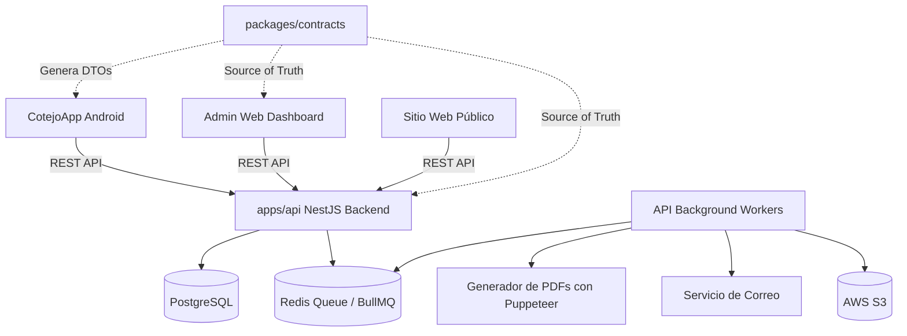
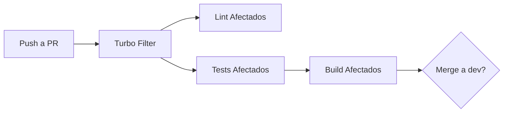

# A.kit Platform (Monorepo)

Monorepo principal del ecosistema A.kit. Este repositorio centraliza el backend, el panel web administrativo, el sitio web público y los contratos compartidos.

## Arquitectura del Ecosistema

## Índice de Documentación Central

Dado que este proyecto es un **Monorepo**, toda la documentación técnica detallada de cada aplicación ha sido centralizada en la carpeta `docs/` de la raíz, para que no tengas que navegar subcarpetas persiguiendo READMEs dispersos.

### 📚 Documentos Core

- 🐳 **[Setup del Entorno Local](docs/setup-local.md):** Cómo levantar Docker Compose (Postgres, Redis, MailHog) y correr el comando maestro de Turborepo.
- ⚙️ **[Arquitectura Global y Agentes](docs/architecture.md):** Reglas base del proyecto y cómo interactuar con los Agentes AI (UX, UI, Code).
- 🧩 **[Contratos (SSOT & Zod Pipeline)](docs/contracts-ssot.md):** Explicación de cómo usamos `zod` y `quicktype-core` para generar modelos hacia Android e inyectar tipos seguros en React y NestJS.
- ☁️ **[Infraestructura y Despliegue (Production)](docs/infra-deployment.md):** Arquitectura Cloud Serverless detallando Vercel, Render, Neon DB, Firebase y Google Play Console.
- 📜 **[API & Swagger (Zod to OpenAPI)](docs/api-swagger.md):** Estrategia y protocolo de generación automática de OpenAPI specs a partir de Zod sin ensuciar controladores.
- 🤖 **[Scripts y Automatización](docs/scripts-automation.md):** Comandos y herramientas transversales (Turborepo, Initializers).

### 💻 Aplicaciones Individuales

- 🔙 **[API Backend (NestJS)](docs/api-backend.md):** Stack técnico en profundidad (TypeORM, BullMQ, AWS S3), flujos de asincronía y convenciones de controladores.
- 💰 **[Monetización del Informe sin Voucher](docs/report-unlock-monetization.md):** Plan de implementación del unlock pagado, contrato backend/Android y setup de Play Console.
- 🎨 **[Web Frontend (React+Vite)](docs/web-frontend.md):** Detalles sobre Tailwind v4, Vitest, JSDOM y arquitectura Feature-first.
- *(Para la App Móvil, consultar el repositorio hermano `CotejoApp` que cuenta con su propia documentación `README.md` a profundidad).*

## Flujo de Git y GitHub

Seguimos una metodología de **Feature Branching**:

1. **Ramas Principales:** `main` (producción) y `develop` (integración).
2. **Pull Requests:** Todo desarrollo se hace en ramas secundarias (ej: `feat/dashboard`, `fix/login`) apuntando a `develop`.
3. **Commits:** Obligatorio usar [Conventional Commits](https://www.conventionalcommits.org/en/v1.0.0/) (ej: `feat(api): add auth endpoint`).

## Integración Continua (CI/CD)

Usamos GitHub Actions. El monorepo cuenta con un pipeline inteligente gracias a Turborepo, que solo ejecuta tests y builds en los paquetes afectados por el Pull Request.

