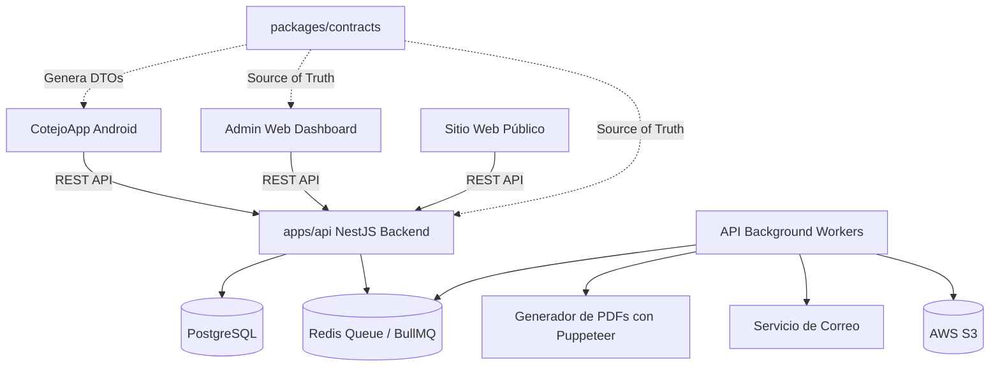
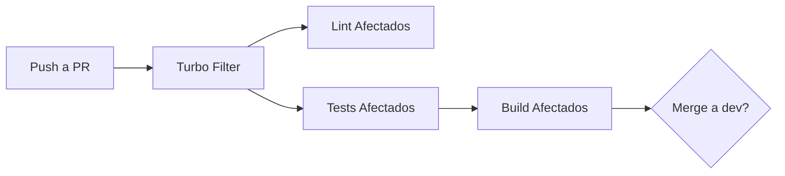

# A.kit Platform (Monorepo)

Monorepo principal del ecosistema A.kit. Este repositorio centraliza el backend, el panel web administrativo, el sitio web público y los contratos compartidos.

## Arquitectura del Ecosistema

```mermaid
graph TD
    ClientApp[CotejoApp Android] -->|REST API| API[apps/api NestJS Backend]
    ClientWeb[Admin Web Dashboard] -->|REST API| API
    ClientSite[Sitio Web Público] -->|REST API| API
    
    API --> DB[(PostgreSQL)]
    API --> Redis[(Redis Queue / BullMQ)]
    
    Worker[API Background Workers] --> Redis
    Worker --> PDF[Generador de PDFs con Puppeteer]
    Worker --> SMTP[Servicio de Correo]
    Worker --> S3[(AWS S3)]
    
    Contracts[packages/contracts] -.->|Source of Truth| API
    Contracts -.->|Source of Truth| ClientWeb
    Contracts -.->|Genera DTOs| ClientApp
```

## Índice de Documentación Central

Dado que este proyecto es un **Monorepo**, toda la documentación técnica y de continuidad está centralizada en `docs/`. El punto de entrada obligatorio es el [índice documental](docs/README.md).

### 📚 Documentos Core

- 🐳 **[Setup del Entorno Local](docs/getting-started.md):** Cómo levantar Docker Compose (Postgres, Redis, Mailpit) y correr los scripts de inicialización.
- ⚙️ **[Arquitectura Global](docs/architecture.md):** Límites, flujos y reglas técnicas.
- 🧩 **[Contratos](docs/contracts.md):** Schemas Zod, compatibilidad y generación Android.
- 📜 **[API Backend](docs/api.md):** Convenciones de NestJS, seguridad, jobs y endpoints.
- 🧭 **[Contexto de producto](docs/product-context.md):** Site, Web, API, roles y modelo B2C/B2B.
- 🛠️ **[Plan de refactor](docs/refactor/README.md):** Fases, dependencias y criterios de salida.
- 📊 **[Estado actual](docs/project-status.md):** Riesgos, evidencia QA y próximo trabajo.
- *(Para la App Móvil, consultar el repositorio hermano `CotejoApp` que cuenta con su propia documentación `README.md` a profundidad).*

## Flujo de Git y GitHub

Seguimos una metodología de **Feature Branching**:

1. **Ramas Principales:** `main` (producción) y `develop` (integración).
2. **Pull Requests:** Todo desarrollo se hace en ramas secundarias (ej: `feat/dashboard`, `fix/login`) apuntando a `develop`.
3. **Commits:** Obligatorio usar [Conventional Commits](https://www.conventionalcommits.org/en/v1.0.0/) (ej: `feat(api): add auth endpoint`).

## Integración Continua (CI/CD)

Usamos GitHub Actions. El monorepo cuenta con un pipeline inteligente gracias a Turborepo, que solo ejecuta tests y builds en los paquetes afectados por el Pull Request.

```mermaid
graph LR
    Push[Push a PR] --> Turbo[Turbo Filter]
    Turbo --> Lint[Lint Afectados]
    Turbo --> Test[Tests Afectados]
    Test --> Build[Build Afectados]
    Build --> Merge{Merge a dev?}
```

