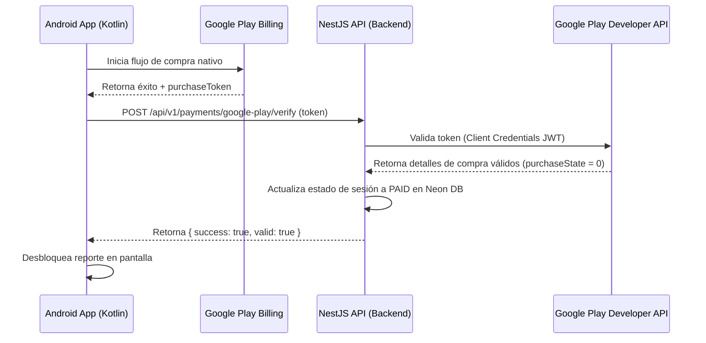

# Guía de Configuración y Validación de Google Play Billing

Esta guía documenta la arquitectura y el proceso paso a paso para configurar la verificación de compras en el backend de **A.kit** utilizando la API de desarrolladores de Google Play. 

Es fundamental seguir estos pasos para que el backend pueda validar de forma segura que los pagos realizados en el cliente Android son legítimos antes de desbloquear reportes o contenido pago.

---

## 1. Arquitectura de Validación de Compras

Para evitar fraudes (clientes Android modificados que simulen compras exitosas), la validación de pagos **nunca debe delegarse exclusivamente en el cliente**. El flujo seguro (Golden Path) es:



---

## 2. Variables de Entorno Requeridas en el Servidor

El backend de NestJS exige dos variables de entorno en su archivo `.env` para poder comunicarse con Google Play:

| Variable | Descripción | Ejemplo |
| :--- | :--- | :--- |
| `ANDROID_PACKAGE_NAME` | El ID de aplicación (Application ID) de la app Android. | `com.akit.app` |
| `GOOGLE_PLAY_SERVICE_ACCOUNT_BASE64` | La llave JSON de la cuenta de servicio de Google Cloud, codificada en una sola línea de texto Base64. | `eyJhY2NvdW50X3R5cGUiOiAic2VydmljZV9hY2NvdW5...` |

---

## 3. Guía de Configuración Paso a Paso (Para Desarrolladores)

### Paso 3.1: Crear el proyecto en Google Cloud
1. Entrá a [Google Cloud Console](https://console.cloud.google.com/).
2. Creá un proyecto nuevo con un nombre representativo (ej: `akit-platform`).
3. En la barra de búsqueda de arriba, busca **"Google Play Android Developer API"** y hacé clic en **Habilitar** (Enable). *Este paso es obligatorio para que el proyecto de Cloud pueda consultar compras de Google Play.*

### Paso 3.2: Asignarse el rol de Administrador de Políticas
Si estás usando una cuenta personal de Google (`@gmail.com`), Google Cloud suele aplicar una política de seguridad restrictiva que impide crear claves JSON externas. Para poder desactivar esta restricción, tenés que darte permisos de administrador global:
1. En el selector de proyectos (barra superior), asegurate de seleccionar la **Organización raíz** o dominio completo (en lugar de tu proyecto específico).
2. Andá a **IAM y administración** > **IAM**.
3. Buscá tu correo electrónico, hacé clic en el lápiz (**Editar acceso**) y añadí el rol:
   * **Administrador de políticas de la organización** (*Organization Policy Administrator*).
4. Guardá los cambios.

### Paso 3.3: Desactivar la restricción de llaves
1. Volvé a seleccionar tu proyecto (`akit-platform`) en la barra superior.
2. Buscá en el buscador global **"Políticas de la organización"** (*Organization policies*).
3. Buscá la política llamada **`disableServiceAccountKeyCreation`** (o *"Desactivar la creación de claves de cuentas de servicio"*).
4. Hacé clic en ella, seleccioná **Editar política** arriba de todo, marcá la opción **Anular política del elemento superior / Personalizar**, y en las reglas elegí **Desactivada** (Off).
5. Guardá los cambios.

### Paso 3.4: Crear la Cuenta de Servicio y clave JSON
1. En tu proyecto de Google Cloud, andá a **IAM y administración** > **Cuentas de servicio** (Service accounts).
2. Hacé clic en **+ Crear cuenta de servicio**.
3. Ponele de nombre `play-billing-verifier` y dale a **Crear y continuar** y luego a **Listo** (no requiere roles de Cloud).
4. Copiá el **correo de la cuenta de servicio** generado (ej: `play-billing-verifier@akit-platform.iam.gserviceaccount.com`).
5. Hacé clic sobre la cuenta de servicio creada, andá a la pestaña **Claves** (Keys) > **Agregar clave** > **Crear clave nueva (JSON)**. Se descargará el archivo `.json` de credenciales a tu computadora de forma segura.

### Paso 3.5: Otorgar acceso financiero en Google Play Console
1. Entrá a tu [Google Play Console](https://play.google.com/console/).
2. En la barra lateral izquierda, andá a **Usuarios y permisos** (Users and permissions).
3. Hacé clic en **Invitar a un nuevo usuario** y pegá el correo de la cuenta de servicio que copiaste en el paso anterior.
4. En la pestaña de **Permisos de la aplicación**, agregá tu app (`com.akit.app`) y marcá únicamente estas dos casillas bajo **Datos económicos**:
   * **Ver datos financieros** *(Permite el acceso a la Purchases API)*.
   * **Gestionar pedidos y suscripciones** *(Permite dar el Acknowledge/Confirmación de compras)*.
5. Hacé clic en **Invitar usuario** (o Guardar).

---

## 4. Codificar el JSON a Base64

Para subir de forma segura la clave privada al servidor (Render, Heroku, etc.) sin saltos de línea ni caracteres rotos, codificamos el archivo JSON descargado en Base64 localmente en la computadora:

* **En Windows (PowerShell):**
  ```powershell
  [Convert]::ToBase64String([IO.File]::ReadAllBytes("C:\Users\TU_USUARIO\Downloads\nombre-de-tu-archivo.json"))
  ```
* **En macOS / Linux (Terminal):**
  ```bash
  base64 -i /ruta/al/archivo.json | tr -d '\n'
  ```

Copiá el texto resultante y cargalo en la variable de entorno `GOOGLE_PLAY_SERVICE_ACCOUNT_BASE64` del servidor de producción o QA.

---

## 5. Guía de Pruebas en Sandbox (Canal Interno)

Para probar cobros de juguete (sin dinero real) en tu teléfono:
1. En Google Play Console, andá a **Configuración** > **Pruebas de licencia** (License testing) y añadí los correos de Gmail de los probadores.
2. En el canal de **Pruebas internas** de la app, agregá los probadores a la lista de correo.
3. **Paso Crítico:** Compartí el **enlace de participación web (Opt-in Link)** de pruebas internas con los probadores. Cada probador debe abrir el enlace en el navegador de su teléfono y hacer clic en **Aceptar invitación** (Become a Tester). *Si no aceptan este enlace, Google Play dará error de "Artículo no encontrado" al intentar comprar.*
4. Descargá la app directamente desde el botón que te da el enlace web redirigiéndote a Google Play Store. ¡Listo! Al abrir la app, la pasarela de facturación se abrirá en modo Sandbox (tarjeta de prueba).
