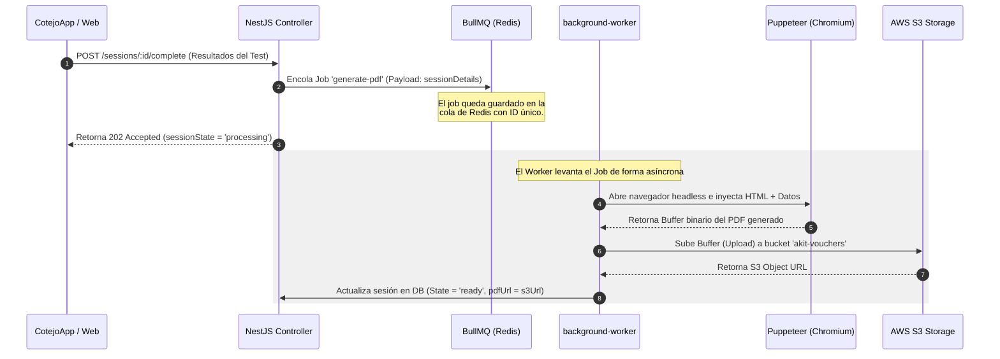

# API Backend (apps/api)

La API de **A.kit Platform** es una aplicación robusta construida sobre **NestJS** que expone servicios RESTful, maneja autenticación híbrida y gestiona procesamiento pesado asíncrono en segundo plano mediante un sistema distribuido de colas.

---

## 📂 Estructura Detallada del Directorio (`apps/api/src/`)

El backend sigue un patrón modular y estructurado que permite mantener la escalabilidad a medida que el negocio crece. A continuación se presenta el mapa de la estructura física en `src/`:

```
src/
├── app.module.ts              # Módulo raíz que importa y coordina todos los módulos
├── main.ts                    # Punto de entrada de la aplicación (inicia el servidor Express)
├── auth/                      # Autenticación JWT y lógica de validación híbrida (con Firebase)
├── categories/                # CRUD de categorías ocupacionales (Holland Codes)
├── common/                    # Filtros globales, interceptores, guards y decoradores reutilizables
├── config/                    # Configuraciones tipadas de TypeORM, Redis, AWS y SMTP
├── database/                  # Semillas (seeding) y lógica de inicialización de la DB
├── institutions/              # Gestión de colegios, universidades y entidades asociadas
├── mail/                      # Módulo de envío de correos utilizando plantillas en Pug
├── migrations/                # Archivos de migración autogenerados y manuales de TypeORM
├── sessions/                  # Control de sesiones de tests activos por usuarios finales
├── stats/                     # Consultas de lectura pesada de estadísticas agregadas para el dashboard
├── users/                     # CRUD de usuarios, roles de administración e instituciones
└── vouchers/                  # Creación, validación y canje de códigos de vouchers de acceso
```

---

## ⚡ Stack Técnico Detallado y Decisiones de Arquitectura

El diseño arquitectónico del backend está orientado a soportar cargas pesadas de lectura (Estadísticas de Reportes) y picos de escrituras concurrentes (canje de miles de vouchers en simultáneo en un colegio) garantizando el menor tiempo de respuesta en el event-loop principal.

1. **NestJS Framework (v11.0.0)**: Elegido por su estructura robusta basada en inyección de dependencias (`DI`), modularización y soporte nativo para TypeScript. Facilita la creación de middleware, interceptores y filtros consistentes.
2. **TypeORM (v0.3.28)**: Data Access Object y Object Relational Mapper relacional. Permite modelar entidades seguras mediante decoradores de TypeScript y controlar de forma milimétrica las conexiones, transacciones y esquemas usando migraciones puras en PostgreSQL.
3. **BullMQ (v5.33.1) & ioredis (v5.10.1)**: Motor de colas robusto y de altísimo rendimiento basado en Redis. NestJS delega tareas de largo procesamiento a BullMQ, evitando bloquear el hilo principal de ejecución web y garantizando la resiliencia mediante políticas de reintento.
4. **Puppeteer (v24.40.0)**: Ejecuta una instancia de Chromium "headless" integrada en los workers asíncronos para rasterizar plantillas HTML a PDFs de reportes vocacionales pesados.
5. **AWS SDK para S3 (v3.1014.0)**: Sube los reportes generados asíncronamente a un bucket de Amazon S3, liberando almacenamiento local en los servidores de la API y permitiendo descargas seguras y directas usando URLs firmadas de corta duración.
6. **nestjs-pino & pino-http**: El logging estructurado en JSON de alto rendimiento es crucial para entornos de producción. Usamos `pino` debido a que es hasta 5 veces más rápido que alternativas tradicionales como Winston, previniendo cuellos de botella por I/O en logs.

---

## 🧩 Flujo de Procesamiento Asíncrono (Workers & BullMQ)

Cuando un usuario termina una sesión de test en la aplicación móvil `CotejoApp`, se dispara un proceso asíncrono para generar el reporte de resultados en PDF. Este flujo está diseñado para garantizar alta resiliencia frente a fallas y una excelente experiencia de usuario:



---

## 🗄️ Gestión de Base de Datos: Migraciones y Seeding

La base de datos PostgreSQL de desarrollo se administra estrictamente a través del CLI de TypeORM. La interacción directa o manual con la DB para alterar esquemas está totalmente prohibida para evitar inconsistencias en producción.

### Comandos de Migración Clave

Las migraciones se deben generar automáticamente comparando tus entidades declaradas en NestJS con el estado actual del esquema de la base de datos local:

1. **Generar una nueva migración:**
   Cada vez que agregues un campo o una nueva tabla en los archivos `*.entity.ts`, corré:
   ```bash
   pnpm run migration:generate src/migrations/NombreDeLaMigracion
   ```
   *Esto compila automáticamente el código de TypeScript, compara la base de datos local e inserta un archivo autogenerado en `src/migrations/`*.
   
2. **Correr las migraciones pendientes:**
   ```bash
   pnpm run migration:run
   ```
   *Aplica todas las clases de migración pendientes sobre tu base de datos configurada*.

---

## 📦 Verificación de Todos los Scripts en `apps/api/package.json`

A continuación se listan **todos** los scripts configurados en el archivo `package.json` de la API, los cuales fueron rigurosamente verificados con el repositorio de forma manual:

| Comando NPM/PNPM | Script Real Ejecutado | Propósito y Funcionamiento Técnico |
| :--- | :--- | :--- |
| `pnpm run build` | `nest build` | Compila toda la aplicación NestJS de TypeScript a código JavaScript puro optimizado dentro de la carpeta `dist/`. |
| `pnpm run format` | `prettier --write "src/**/*.ts" "test/**/*.ts"` | Formatea todo el código fuente del proyecto aplicando los estilos definidos en `.prettierrc`. |
| `pnpm run start` | `nest start` | Inicia la API en producción consumiendo directamente la compilación de NestJS (sin modo observador). |
| `pnpm run dev` | `nest start --watch` | Levanta la API en modo de desarrollo con Hot Module Replacement (HMR) y observador de cambios en vivo. |
| `pnpm run start:dev` | `nest start --watch` | Alias directo de `pnpm run dev` para compatibilidad estándar. |
| `pnpm run start:debug` | `nest start --debug --watch` | Levanta la aplicación con el inspector de Node.js activado (puerto por defecto: `9229`) para adjuntar debuggers externos (VS Code, Chrome DevTools). |
| `pnpm run start:prod` | `node dist/main` | Inicia la API ejecutando el archivo compilado final `dist/main.js`. Es el comando que se debe usar en entornos de producción (Render, AWS ECS, Heroku). |
| `pnpm run lint` | `eslint "{src,apps,libs,test}/**/*.ts" --fix` | Analiza el código buscando code smells e inconsistencias del compilador y auto-corrige los errores de estilo. |
| `pnpm run test` | `jest` | Ejecuta todos los tests unitarios y de integración definidos en el proyecto utilizando Jest. |
| `pnpm run test:watch` | `jest --watch` | Ejecuta Jest en modo interactivo observando y re-ejecutando tests asociados a archivos editados en vivo. |
| `pnpm run test:cov` | `jest --coverage` | Ejecuta los tests de Jest y genera un reporte detallado de cobertura (cobertura de líneas, ramas, funciones). |
| `pnpm run test:debug` | `node --inspect-brk ... node_modules/.bin/jest --runInBand` | Ejecuta los tests secuencialmente deteniéndose en el primer punto de quiebre (breakpoint) para debugging profundo. |
| `pnpm run test:e2e` | `jest --config ./test/jest-e2e.json` | Ejecuta las pruebas de extremo a extremo (End-To-End) usando una base de datos de pruebas dedicada y `supertest` para simular llamadas HTTP. |
| `pnpm run typeorm` | `node ./node_modules/typeorm/cli.js` | Acceso directo al CLI de TypeORM para ejecutar comandos de esquema, consultas o utilidades. |
| `pnpm run migration:generate` | `pnpm build && node ./node_modules/typeorm/cli.js migration:generate -d dist/config/typeorm.config.js src/migrations/` | Compila el backend y autogenera una clase de migración TypeScript a partir del diff de las entidades vs. DB. |
| `pnpm run migration:run` | `pnpm build && node ./node_modules/typeorm/cli.js migration:run -d dist/config/typeorm.config.js` | Compila el backend y ejecuta todas las migraciones pendientes en PostgreSQL. |
| `pnpm run seed` | `pnpm seed:base` | Alias para poblar la base de datos local con la data base por defecto. |
| `pnpm run seed:admin` | `pnpm build && node dist/database/seeds/admin-seed.js` | Inserta únicamente los usuarios iniciales con rol de súper administrador. |
| `pnpm run seed:institution` | `pnpm build && node dist/database/seeds/institution-seed.js` | Inserta colegios e instituciones educativas mockeadas para desarrollo local. |
| `pnpm run seed:tres-areas` | `pnpm build && node dist/database/seeds/tres-areas-combinations-seed.js` | Inserta las combinaciones de resultados basadas en la teoría Holland. |
| `pnpm run seed:base` | `pnpm build && node dist/database/seeds/base-seed.js` | Poblamiento completo coordinado de toda la data base de desarrollo de una sola vez. |
| `pnpm run db:bootstrap` | `pnpm migration:run && pnpm seed:base` | **El comando de oro para onboarding:** Corre migraciones y siembra toda la base de datos de pruebas inicial. |
| `pnpm run db:reset` | *(Comando complejo TypeORM drop + run + seed)* | Borra todas las tablas de Postgres, las vuelve a crear con migraciones y vuelve a poblar las semillas. |

---

## 📝 Ejemplo de Integración Técnica y Convenciones de Código

### 1. Convención de Controladores (Autenticación y Tipado de Retorno)
Todos los endpoints expuestos deben seguir la estructura tipada, inyectando DTOs validados en el Request y usando respuestas estándar de NestJS:

```typescript
// src/vouchers/vouchers.controller.ts
import { Controller, Post, Body, UseGuards, HttpStatus, HttpCode } from '@nestjs/common';
import { VouchersService } from './vouchers.service';
import { JwtAuthGuard } from '../auth/guards/jwt-auth.guard';
import { RolesGuard } from '../auth/guards/roles.guard';
import { Roles } from '../auth/decorators/roles.decorator';
import { CreateVoucherDto } from '@akit/contracts'; // SSOT Monorepo dependency

@Controller('vouchers')
@UseGuards(JwtAuthGuard, RolesGuard)
export class VouchersController {
  constructor(private readonly vouchersService: VouchersService) {}

  @Post('generate')
  @Roles('admin', 'institution_manager')
  @HttpCode(HttpStatus.CREATED)
  async generateVouchers(@Body() createVoucherDto: CreateVoucherDto) {
    // createVoucherDto ya está validado por class-validator a nivel global
    return this.vouchersService.generate(createVoucherDto);
  }
}
```

### 2. Definición Resiliente de un Worker de BullMQ
El siguiente código ilustra cómo se estructura técnicamente el procesador que corre en background en segundo plano, evitando colapsar el hilo web:

```typescript
// src/sessions/processors/session-report.processor.ts
import { Processor, WorkerHost } from '@nestjs/bullmq';
import { Job } from 'bullmq';
import { Logger } from '@nestjs/common';
import { SessionsService } from '../sessions.service';

@Processor('session-reports')
export class SessionReportProcessor extends WorkerHost {
  private readonly logger = new Logger(SessionReportProcessor.name);

  constructor(private readonly sessionsService: SessionsService) {
    super();
  }

  async process(job: Job<{ sessionId: string }>): Promise<string> {
    const { sessionId } = job.data;
    this.logger.log(`Iniciando procesamiento asíncrono de PDF para sesión: ${sessionId}`);
    
    try {
      // 1. Genera PDF usando Puppeteer localmente
      // 2. Sube el Buffer binario generado a AWS S3
      // 3. Guarda la URL final en la entidad de sesión en DB
      const pdfUrl = await this.sessionsService.generateAndUploadPdf(sessionId);
      
      this.logger.log(`PDF generado y subido con éxito a: ${pdfUrl}`);
      return pdfUrl;
    } catch (error) {
      this.logger.error(`Falla crítica en Job ${job.id} para sesión ${sessionId}`, error.stack);
      // BullMQ reintentará automáticamente este Job según las políticas configuradas
      throw error;
    }
  }
}
```
