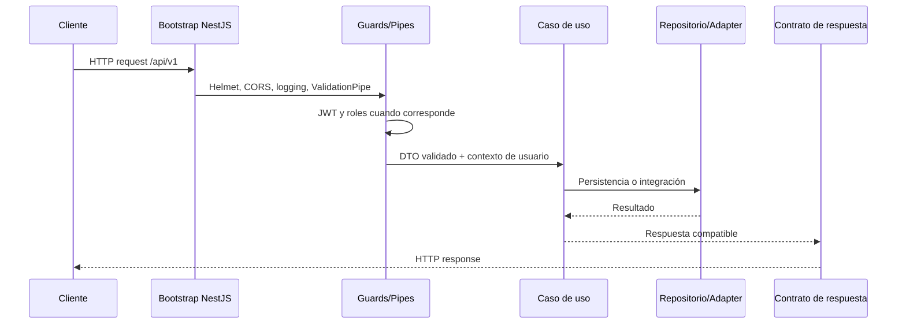
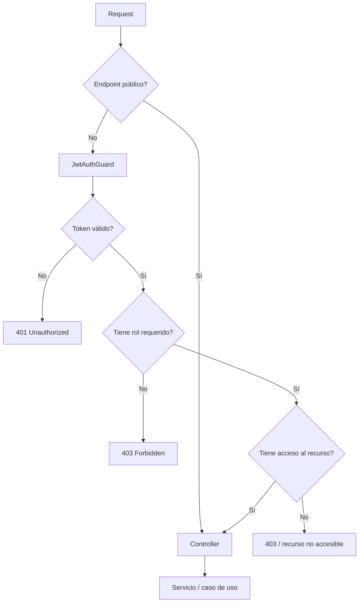
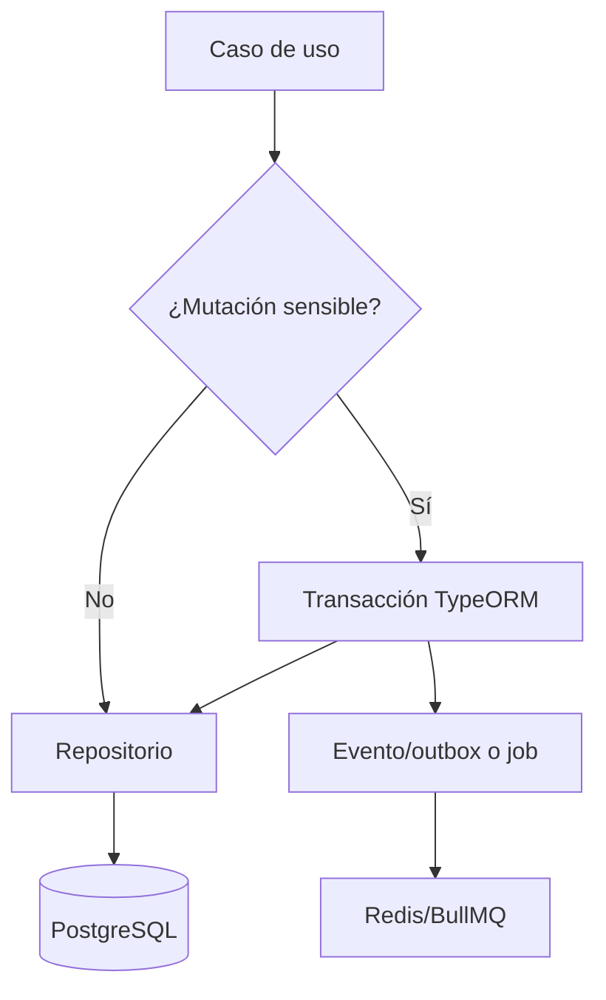
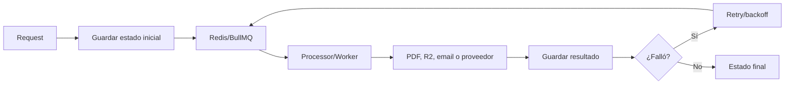
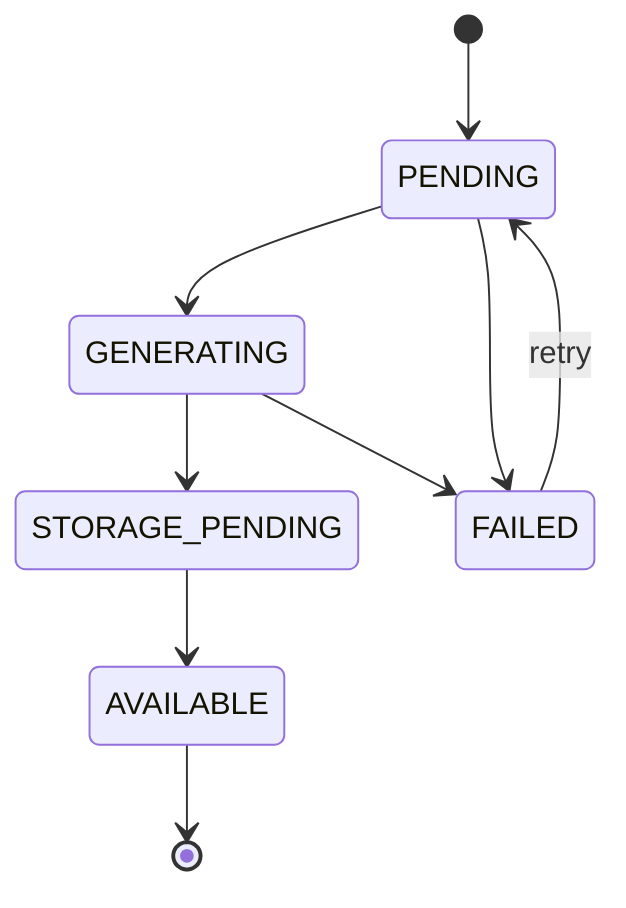

# API Backend

La API es el punto central de acceso al dominio de A.kit Platform. Está implementada con NestJS en `apps/api` y expone HTTP para Web, Site y Android.

## Responsabilidades

- Autenticar usuarios y validar tokens de Firebase/JWT.
- Aplicar permisos por rol y alcance institucional.
- Ejecutar casos de uso de sesiones, vouchers, reportes y pagos.
- Persistir estado transaccional en PostgreSQL.
- Coordinar jobs mediante Redis/BullMQ.
- Integrar almacenamiento privado, email, PDF y proveedores de pago.
- Exponer health checks y errores con una forma consistente.

La API no debe ser reemplazada por acceso directo de los clientes a PostgreSQL, Redis o proveedores externos.

## Inicio de una request



El bootstrap aplica `ValidationPipe` global con whitelist, rechazo de propiedades no permitidas y transformación de tipos. El prefijo global es `/api/v1`.

Excepciones:

- `GET /health` no usa el prefijo.
- `GET /` no usa el prefijo.
- Los webhooks de pagos se exponen bajo `/api/v1/webhooks/payments/:gateway` y necesitan conservar el body crudo para verificar la firma.

## Módulos principales

| Módulo                   | Responsabilidad                                             | Integraciones                             |
| ------------------------ | ----------------------------------------------------------- | ----------------------------------------- |
| `auth`                   | Login, tokens, cambio de contraseña, Firebase y guards      | PostgreSQL, Firebase                      |
| `sessions`               | Creación, finalización, resultados, métricas y acceso       | PostgreSQL, reportes                      |
| `vouchers`               | Vouchers, batches, redeem, revocación y consultas           | PostgreSQL, notificaciones                |
| `reports`                | Estado, grants, auditoría, PDF, storage y delivery          | PostgreSQL, BullMQ, Puppeteer, R2, email  |
| `payments`               | Pricing, checkout, eventos, fulfillment y Google Play       | PostgreSQL, Redis, Stripe/MP, Google Play |
| `notifications`          | Eventos y transportes de correo                             | SMTP, Resend                              |
| `common`                 | Infraestructura transversal, colas, rate limiting y errores | Redis, Puppeteer, R2                      |
| `users` / `institutions` | Administración de identidades y ámbitos                     | PostgreSQL                                |
| `stats` / `categories`   | Métricas y catálogo vocacional                              | PostgreSQL                                |

La composición de módulos se concentra en `apps/api/src/app.module.ts`. Antes de agregar un módulo, definí qué caso de uso posee y qué dependencia externa necesita.

## Autenticación y autorización



### Tokens

- JWT propios usan `JWT_SECRET` y una expiración configurable.
- Tokens de Firebase se verifican con certificados públicos y deben tener email verificado.
- `FIREBASE_PROJECT_ID` es obligatorio para comprobar issuer y audience.
- La identidad resuelta debe convertirse en un contexto de usuario/paciente antes de ejecutar el caso de uso.

### Roles y alcance

Los guards responden preguntas diferentes:

- `JwtAuthGuard`: ¿la identidad está autenticada?
- `RolesGuard`: ¿el rol permite la operación?
- Servicios de acceso: ¿esa identidad puede operar sobre ese usuario, institución, sesión, voucher o reporte?

No confundir tener un rol con tener acceso a un recurso concreto.

## Mapa de endpoints por capacidad

La referencia exhaustiva de request/response debe generarse desde los contratos y Swagger. Este mapa sirve para ubicar código y permisos.

| Capacidad        | Rutas principales                                           | Acceso                      |
| ---------------- | ----------------------------------------------------------- | --------------------------- |
| Auth             | `/auth/login`, cambio de contraseña, logout, reset          | Mixto: público + JWT        |
| Sessions         | Crear, completar, listar, detalle, resultados, métricas     | Público/JWT según operación |
| Admin sessions   | Overview, actividad y agregados                             | `ADMIN`                     |
| Vouchers         | Crear, resolver, redeem, revocar, listar y detalle de batch | Admin/JWT + scope           |
| Reports          | Estado, descarga, delivery, grants                          | JWT + ownership/scope       |
| Pricing/checkout | Planes, checkout, status e historial                        | Institución/JWT             |
| Payment webhooks | `/webhooks/payments/:gateway`                               | Firma del proveedor         |
| Google Play      | Verificación de compra                                      | JWT + guard de paciente     |
| Health           | `/health`, `/`                                              | Público                     |

## Persistencia y transacciones



Reglas actuales:

- TypeORM usa `synchronize: false`; los cambios de esquema se hacen con migraciones.
- Las migraciones se ejecutan en orden y con transacción `each`.
- Redeem de vouchers, checkout, webhook y fulfillment usan persistencia transaccional cuando la operación puede duplicarse o dejar estados parciales.
- Un servicio no debe asumir que escribir en la base y publicar un job son una única operación atómica sin revisar el mecanismo de outbox/idempotencia.
- Los repositories encapsulan acceso a TypeORM; los controllers no deben consultar entidades directamente.

Comandos principales desde `apps/api`:

```powershell
pnpm migration:generate
pnpm migration:run
pnpm db:bootstrap
pnpm db:setup:local
pnpm db:reset
```

`db:reset` destruye el schema local. Nunca usarlo contra una base que deba conservarse.

## Jobs y procesamiento asíncrono



Las colas principales cubren email, PDF, reportes, envío de reportes y métricas. El procesamiento debe ser:

- Idempotente ante reintentos.
- Seguro ante jobs duplicados.
- Observable mediante estado persistido y logs sin secretos.
- Capaz de dejar el recurso en `FAILED` o `BLOCKED` cuando no puede continuar.

Para reportes, el worker genera el PDF desde un snapshot inmutable, lo guarda en storage privado y actualiza el estado del reporte. Para fulfillment, el evento de pago no debe conceder el acceso dos veces.

## Pagos y webhooks

El flujo de pagos tiene dos entradas:

1. Checkout iniciado por un cliente autenticado.
2. Webhook firmado enviado por el proveedor.

El webhook debe:

- Validar el gateway solicitado.
- Verificar la firma con el body crudo.
- Resolver el evento externo.
- Registrar el evento de forma idempotente.
- Actualizar el estado transaccional.
- Encolar fulfillment si corresponde.
- Responder sin repetir efectos para eventos ya procesados.

Los adapters de Stripe y Mercado Pago encapsulan diferencias del proveedor. El resto de la API debe trabajar con el contrato interno y no con payloads externos.

## Reportes y archivos privados

Los reportes no se sirven desde una carpeta pública. El acceso pasa por autorización y auditoría; el archivo se recupera desde storage privado.

Un reporte mantiene ciclo de vida propio:



La generación puede fallar por datos, Puppeteer, almacenamiento o entrega. El diagnóstico debe identificar en qué transición falló, no sólo mostrar el error final al cliente.

## Errores y observabilidad

Al agregar un error nuevo documentar:

- Código estable y HTTP status.
- Condición que lo dispara.
- Si el cliente puede reintentar.
- Correlation/request id si existe.
- Información segura para logs.
- Respuesta compatible con `packages/contracts`.

Nunca loguear tokens, API keys, contraseñas, payloads completos de pago ni datos personales innecesarios.

Health y readiness deben considerarse diferentes: que el proceso HTTP responda no significa que PostgreSQL, Redis, pagos o storage estén listos para operar.

## Cómo agregar una feature

1. Definí el caso de uso y el actor autorizado.
2. Revisá o agregá el contrato en `packages/contracts`.
3. Agregá DTO/schema y pruebas de validación.
4. Implementá el servicio/caso de uso.
5. Usá repository o adapter para infraestructura.
6. Agregá controller y guards mínimos necesarios.
7. Si hay mutación, definí transacción e idempotencia.
8. Si hay trabajo lento, usá una cola y documentá retries/fallos.
9. Agregá pruebas unitarias e integración para el flujo crítico.
10. Actualizá documentación y variables si corresponde.

## Verificación antes de una PR

```powershell
pnpm --filter api build
pnpm --filter api test
pnpm --filter api test:e2e
pnpm --filter api lint
```

Según el cambio, sumar pruebas específicas de pagos, migraciones, reportes o contratos. Una PR que cambia un endpoint debe incluir el contrato actualizado y evidencia de compatibilidad.

## Referencias

- [Arquitectura de la plataforma](architecture.md)
- [Contratos compartidos](contracts.md)
- [Primer día de desarrollo](getting-started.md)
- [Variables de entorno y credenciales](deployment-environment.md)
- [Roadmap de documentación](documentation-roadmap.md)
