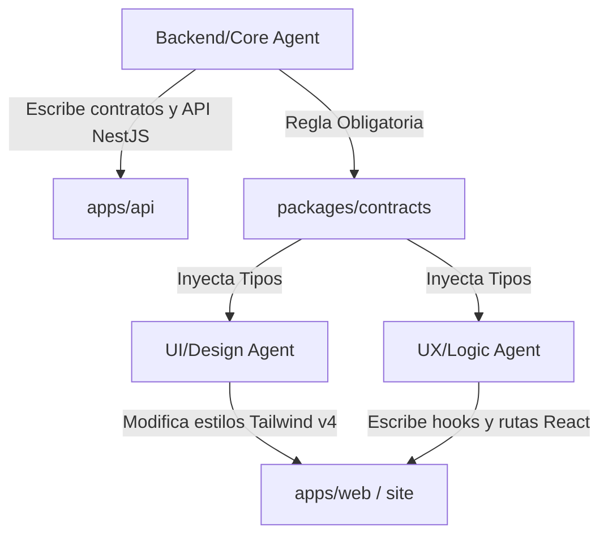

# Arquitectura Global y Convenciones del Monorepo

Este documento rige la estructura de diseño, patrones arquitectónicos y políticas de desarrollo para todo el monorepo de **A.kit Platform** y sus dependencias externas. Es de lectura obligatoria para cualquier desarrollador y sirve como directiva base para los Agentes Autónomos de Inteligencia Artificial que colaboren en el proyecto.

---

## 🏛️ Estructura del Monorepo (pnpm Workspaces)

Usamos un esquema de monorepo gestionado por **pnpm** y coordinado por **Turborepo** para administrar múltiples aplicaciones y paquetes compartidos de manera eficiente.

```
akit-platform/
├── apps/                         # Aplicaciones Desplegables (Servicios)
│   ├── api/                      # Backend NestJS (API + Workers)
│   ├── web/                      # Panel de administración React (Admin Dashboard)
│   └── site/                     # Landing page pública corporativa (Astro)
├── packages/                     # Librerías y Paquetes de Soporte Interno
│   ├── contracts/                # Fuente de verdad de DTOs y esquemas de validación Zod
│   └── design-tokens/            # Variables de diseño CSS/JSON corporativas
├── infra/                        # Configuración de despliegue
│   └── docker/                   # Contenedores de Postgres, Redis, pgAdmin y MailHog
└── scripts/                      # Automatizaciones globales del monorepo
```

### Resolución de Dependencias en Caliente
Los workspaces permiten que las aplicaciones utilicen dependencias locales sin necesidad de publicarlas en registros como NPM. Por ejemplo, en `apps/api/package.json` declaramos:
```json
"dependencies": {
  "@akit/contracts": "workspace:*"
}
```
Esto le indica a pnpm que en lugar de buscar la dependencia en la red, cree un enlace lógico (symlink) directo a la carpeta local `packages/contracts/`. Cualquier cambio guardado en `contracts` se refleja al instante en el backend y frontend sin necesidad de re-instalar.

---

## 🛡️ Patrones de Diseño por Componente

### 1. API Backend: Arquitectura Hexagonal y CQRS Semántico

El backend (`apps/api`) está diseñado siguiendo los principios de la **Arquitectura Hexagonal (Puertos y Adaptadores)** y una segregación de responsabilidades de lectura/escritura inspirada en **CQRS**.

```
  [ Cliente Externo (CotejoApp / Web) ]
                  │
                  ▼ (Llamada HTTP REST)
          [ Adaptadores Primarios ]
             (Controllers / DTOs)
                  │
                  ▼ (Inyección de Dependencias)
            [ Capa de Dominio ]
            (Services / Business Rules)
           /              \
          / (Lectura)      \ (Escritura)
         ▼                  ▼
  [ Stats Módulo ]    [ Repositorios ] (Ports)
  (Query Directa)           │
                            ▼
                  [ Adaptadores Secundarios ]
                     (TypeORM / Postgres)
```

- **Separación Limpia (CQRS):** Los flujos de escritura (ej. creación de vouchers, canje, inicio de test) pasan por servicios de dominio rígidos y transaccionales controlados por TypeORM. Los flujos de lectura masiva (ej. el dashboard de estadísticas de colegios) se desvían a controladores optimizados en el módulo `stats/` que ejecutan queries relacionales sumamente veloces, evitando la sobrecarga de capas innecesarias.
- **DTOs Mandatorios:** Todos los adaptadores de entrada (controladores) deben tipar estrictamente el cuerpo de las requests usando clases de `@akit/contracts`, validados globalmente por NestJS mediante `ValidationPipe`.
- **Aislamiento de la Base de Datos:** Los servicios de negocio nunca interactúan directamente con las conexiones de bases de datos crudas; consumen la abstracción de interfaces (Repository Pattern) provistas por TypeORM, facilitando el testing mediante mocks de repositorio.

---

## 🎨 2. Web Frontend: Arquitectura Feature-First y Diseño Atómico

El panel de administración (`apps/web`) organiza su código basándose en el comportamiento del negocio en lugar del tipo de archivo técnico.

### Feature-First Organization
En lugar de agrupar todos los componentes en una sola carpeta masiva de `components/` y todos los hooks en `hooks/`, agrupamos por contexto de negocio dentro de `/features`:
- **`features/auth/`:** Contiene `Login.tsx`, `useLogin.ts`, `ForgotPassword.tsx` y sus estilos locales.
- **`features/dashboard/`:** Contiene los componentes de analíticas, integraciones de Recharts y hooks de datos institucionales.

Esto asegura que si un desarrollador necesita refactorizar la lógica del Login, todo el código relevante esté contenido en una sola carpeta, reduciendo la fricción y el scrolling mental.

### Atomic Design en Componentes Reutilizables
Para los componentes genéricos que no pertenecen a ninguna feature particular (ej. un Botón de carga, un Input de texto corporativo), se aplica **Diseño Atómico** básico:
- **Átomos:** Componentes mínimos e indivisibles (ej. `Badge`, `Avatar`, `Button`).
- **Moléculas:** Combinaciones sencillas de átomos (ej. `SearchInput` = Input + Lupa + Botón Limpiar).

---

## 🤖 3. Protocolo de Coordinación para Desarrollo Asistido por Agentes (AI)

Al trabajar en un ecosistema robusto de desarrollo en pareja con programadores AI, se definen estrictamente tres roles especializados para evitar conflictos y sobreescrituras en las ramas Git:

### Roles de Agentes AI en A.kit



1. **Agent UX (Lógica de Interfaz):**
   - **Alcance:** Modifica lógica en los componentes React, custom hooks (`/hooks`), y configuraciones del ruteador en `apps/web`.
   - **Regla:** No debe escribir estilos manuales complejos en CSS; debe apoyarse en las clases utilitarias de Tailwind preconfiguradas.

2. **Agent UI (Diseño y Maquetación):**
   - **Alcance:** Modifica archivos estéticos globales, `index.css`, layouts y animaciones CSS de Tailwind v4.
   - **Regla:** Trabaja exclusivamente sobre las clases visuales. Si necesita lógica interactiva compleja, debe delegarla al Agent UX para evitar romper estados de React.

3. **Agent Code (Backend & Pipelines de Datos):**
   - **Alcance:** Responsable de `apps/api`, `packages/contracts`, Docker, base de datos y migraciones de TypeORM.
   - **Regla de Oro:** **Cero "breaking changes" sin aviso.** Si modifica un contrato de datos en `packages/contracts`, está obligado a ejecutar inmediatamente el script `pnpm run generate:android` para asegurar que las clases de Kotlin no rompan el proyecto mobile hermano, y notificar a los agentes del Frontend para que adapten sus componentes.
