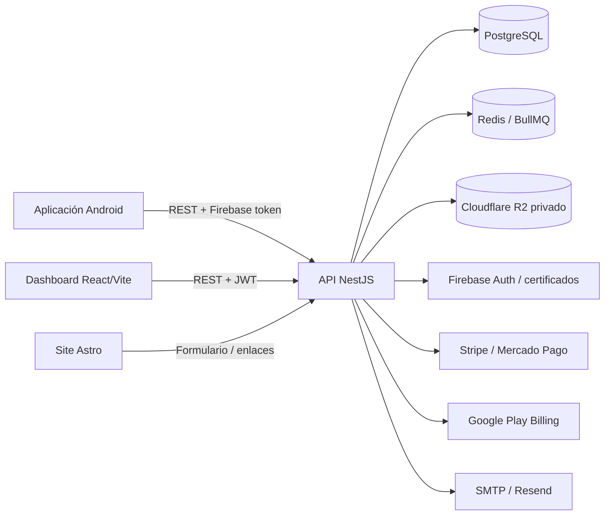
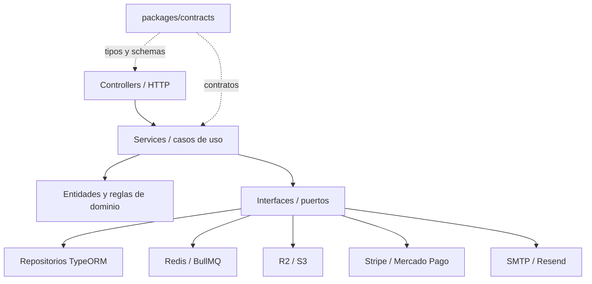
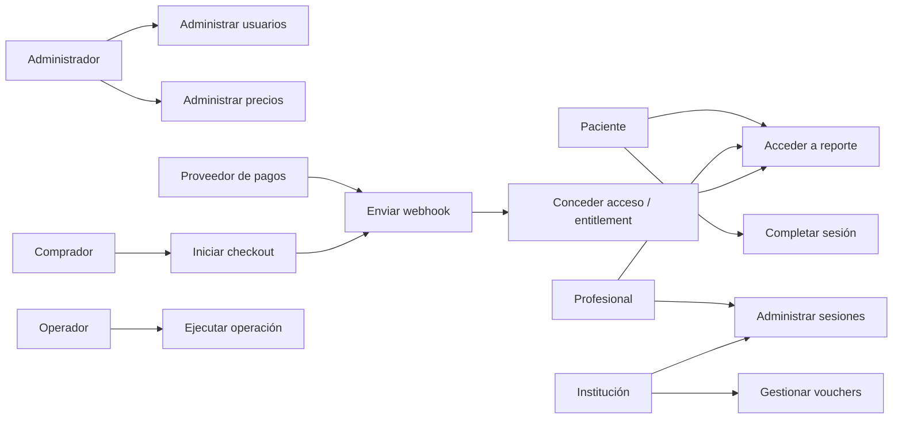
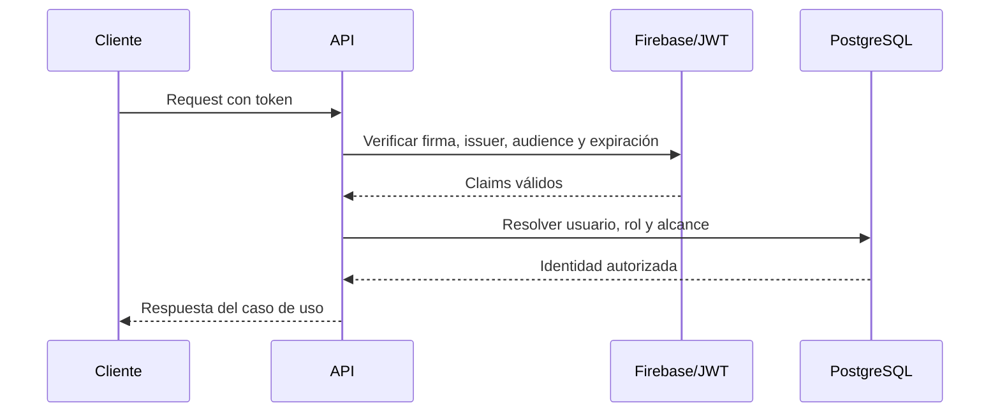
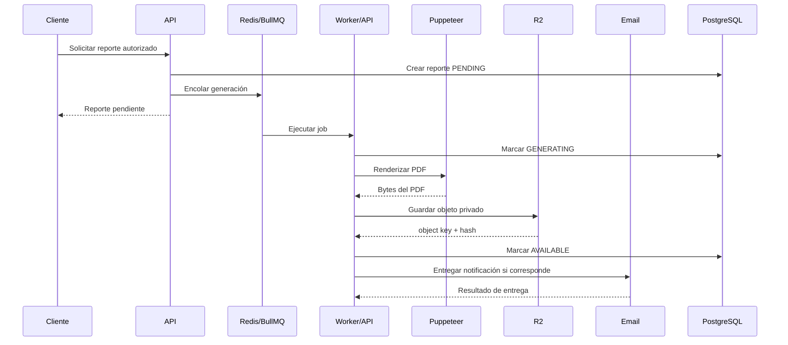
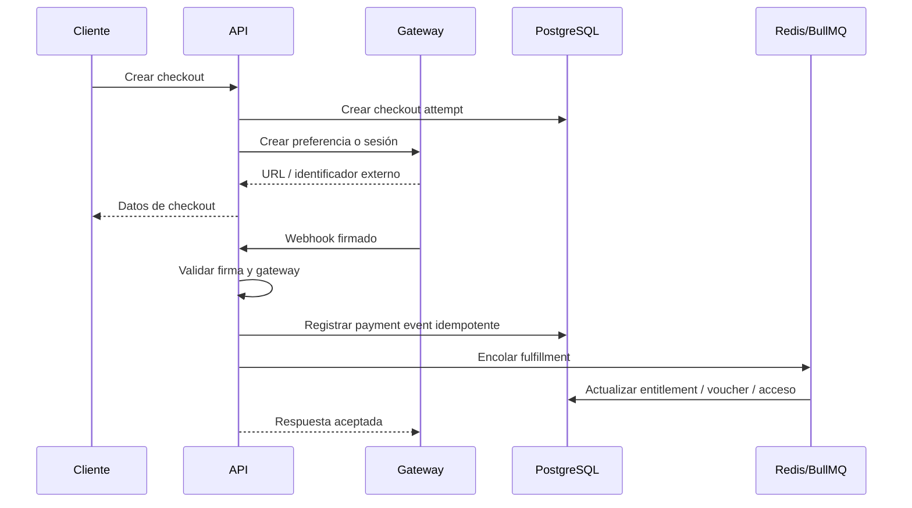
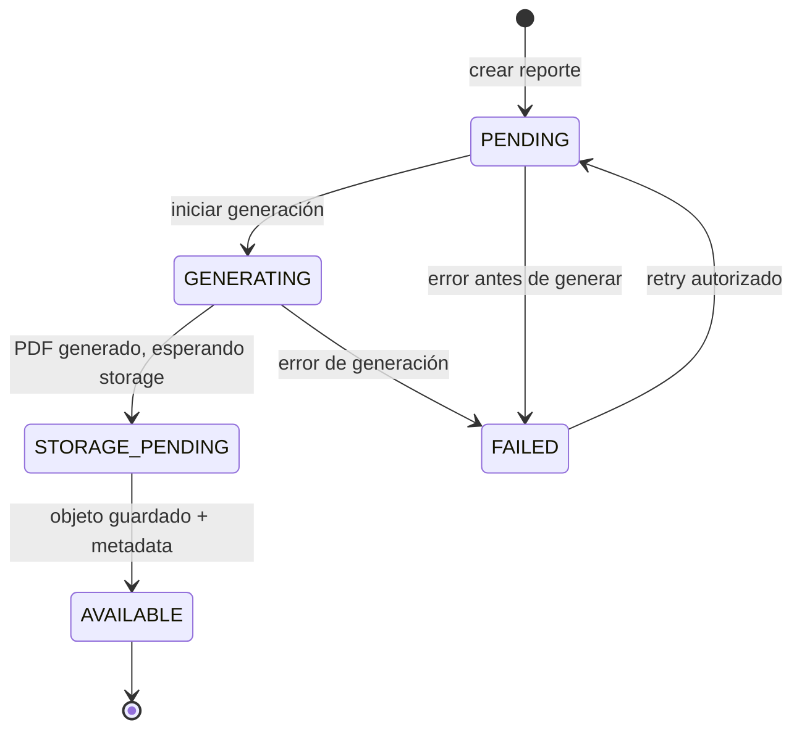
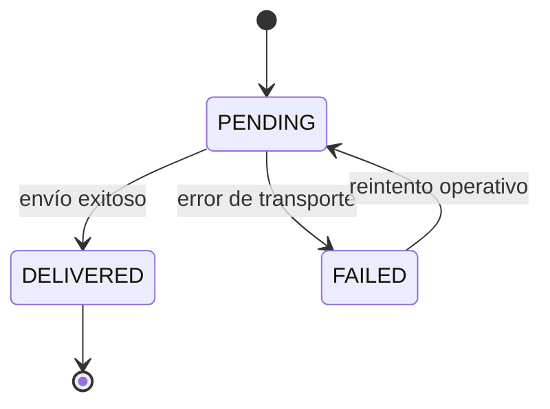
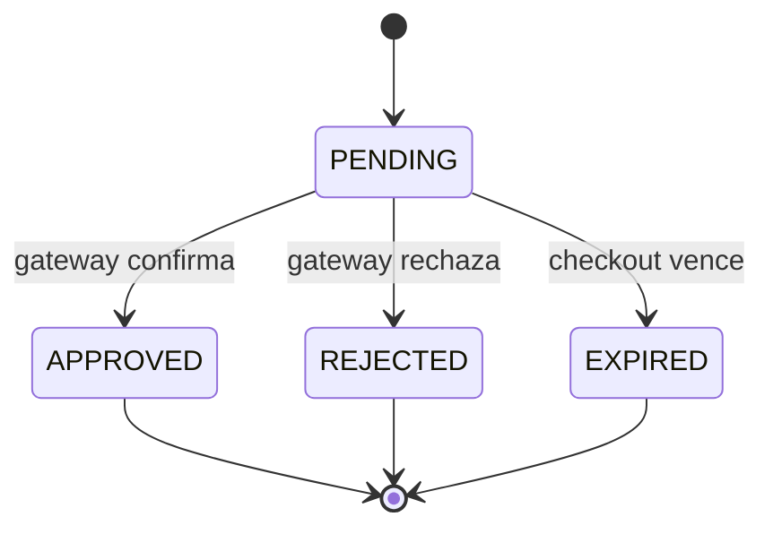
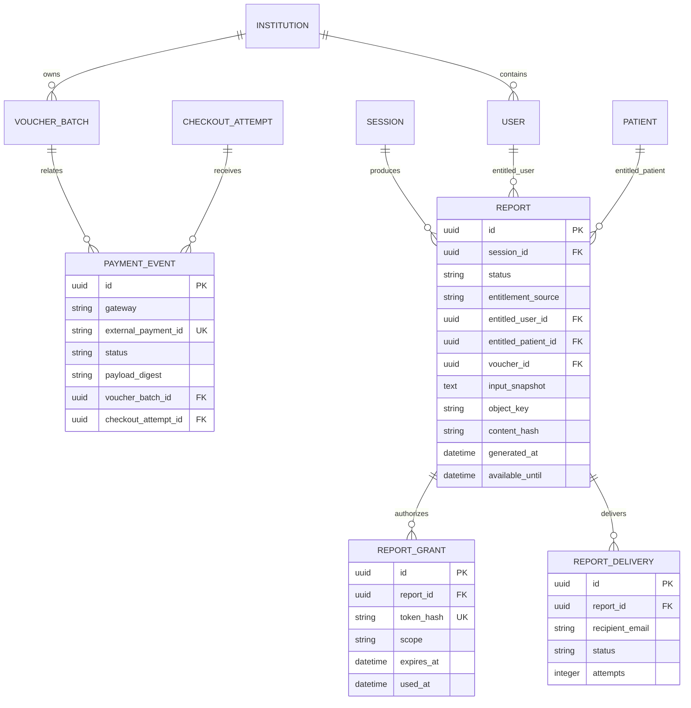

# Arquitectura de A.kit Platform

Este documento explica cómo se divide la plataforma, qué responsabilidades tiene cada componente y cuáles son los flujos críticos. Está dirigido a desarrolladores que necesitan ubicar una funcionalidad o diagnosticar una integración.

## Resumen ejecutivo

A.kit Platform es un monorepo con tres superficies de usuario y una API central:

- `apps/api`: backend NestJS, autenticación, negocio, persistencia, pagos, jobs y reportes.
- `apps/web`: dashboard administrativo React/Vite.
- `apps/site`: sitio público estático Astro.
- `packages/contracts`: contratos compartidos y fuente de verdad de datos entre API, Web y Android.
- `packages/design-tokens`: tokens visuales compartidos.

La API es el único punto de acceso al dominio y a los secretos. Web y Site son clientes; no deben contener credenciales ni lógica de negocio crítica.

## Mapa de contexto

```mermaid
graph LR
    Android[Aplicación Android] -->|REST + Firebase token| API[API NestJS]
    Web[Dashboard React/Vite] -->|REST + JWT| API
    Site[Site Astro] -->|Formulario / enlaces| API

    API --> DB[(PostgreSQL)]
    API --> Redis[(Redis / BullMQ)]
    API --> R2[(Cloudflare R2 privado)]
    API --> Firebase[Firebase Auth / certificados]
    API --> Payments[Stripe / Mercado Pago]
    API --> Play[Google Play Billing]
    API --> Mail[SMTP / Resend]
```

### Regla de límites

| Componente   | Responsabilidad                                                 | No debe hacer                                        |
| ------------ | --------------------------------------------------------------- | ---------------------------------------------------- |
| Web          | Renderizar UI, manejar interacción y llamar contratos/API       | Acceder a DB, usar secretos o decidir reglas de pago |
| Site         | Presentar contenido público y enviar formularios                | Contener secretos o duplicar lógica de negocio       |
| API          | Autenticar, validar, ejecutar casos de uso y coordinar adapters | Exponer credenciales o saltarse contratos            |
| Contracts    | Definir schemas, tipos y compatibilidad                         | Ejecutar persistencia o lógica de infraestructura    |
| PostgreSQL   | Persistir estado transaccional                                  | Ser accedido directamente por clientes               |
| Redis/BullMQ | Colas, rate limiting e idempotencia distribuida                 | Ser la fuente de verdad del dominio                  |
| R2           | Guardar reportes privados                                       | Servir objetos sin autorización                      |

## Arquitectura interna de la API

```mermaid
graph TD
    Controller[Controllers / HTTP] --> Application[Services / casos de uso]
    Application --> Domain[Entidades y reglas de dominio]
    Application --> Ports[Interfaces / puertos]
    Ports --> PostgresAdapter[Repositorios TypeORM]
    Ports --> QueueAdapter[Redis / BullMQ]
    Ports --> StorageAdapter[R2 / S3]
    Ports --> PaymentAdapter[Stripe / Mercado Pago]
    Ports --> NotificationAdapter[SMTP / Resend]

    Contracts[packages/contracts] -. tipos y schemas .-> Controller
    Contracts -. contratos .-> Application
```

El código puede tener variaciones por módulo, pero la decisión arquitectónica es estable: los controladores reciben y traducen HTTP; los servicios coordinan casos de uso; los adapters encapsulan proveedores externos; las entidades protegen invariantes del dominio.

## Casos de uso principales

### Actores

| Actor              | Objetivo                                                           |
| ------------------ | ------------------------------------------------------------------ |
| Paciente           | Completar una sesión y acceder a su reporte autorizado.            |
| Profesional        | Crear o consultar sesiones y reportes según sus permisos.          |
| Institución        | Administrar usuarios, sesiones, vouchers y reportes de su ámbito.  |
| Administrador      | Administrar la plataforma, precios, usuarios y operaciones.        |
| Proveedor de pagos | Confirmar o rechazar una transacción mediante webhook.             |
| Operador           | Ejecutar seeds, migraciones, diagnóstico y recuperación operativa. |

### Mapa de casos de uso

```mermaid
graph LR
    Patient[Paciente] --> Session[Completar sesión]
    Patient --> ReportAccess[Acceder a reporte]
    Therapist[Profesional] --> SessionAdmin[Administrar sesiones]
    Therapist --> ReportAccess
    Institution[Institución] --> Voucher[Gestionar vouchers]
    Institution --> SessionAdmin
    Admin[Administrador] --> UserAdmin[Administrar usuarios]
    Admin --> Pricing[Administrar precios]
    Buyer[Comprador] --> Checkout[Iniciar checkout]
    PaymentProvider[Proveedor de pagos] --> Webhook[Enviar webhook]
    Operator[Operador] --> Operations[Ejecutar operación]

    Checkout --> Webhook
    Webhook --> Entitlement[Conceder acceso / entitlement]
    Entitlement --> ReportAccess
```

### Flujo: autenticación

```mermaid
sequenceDiagram
    participant C as Cliente
    participant A as API
    participant F as Firebase/JWT
    participant D as PostgreSQL

    C->>A: Request con token
    A->>F: Verificar firma, issuer, audience y expiración
    F-->>A: Claims válidos
    A->>D: Resolver usuario, rol y alcance
    D-->>A: Identidad autorizada
    A-->>C: Respuesta del caso de uso
```

La API exige `FIREBASE_PROJECT_ID` para validar tokens directos de Firebase. El dashboard también usa el flujo JWT propio. La autorización debe resolverse en backend aunque el frontend oculte una opción de UI.

### Flujo: generación y entrega de reporte

```mermaid
sequenceDiagram
    participant C as Cliente
    participant A as API
    participant Q as Redis/BullMQ
    participant W as Worker/API
    participant P as Puppeteer
    participant R as R2
    participant M as Email
    participant D as PostgreSQL

    C->>A: Solicitar reporte autorizado
    A->>D: Crear reporte PENDING
    A->>Q: Encolar generación
    A-->>C: Reporte pendiente
    Q->>W: Ejecutar job
    W->>D: Marcar GENERATING
    W->>P: Renderizar PDF
    P-->>W: Bytes del PDF
    W->>R: Guardar objeto privado
    R-->>W: object key + hash
    W->>D: Marcar AVAILABLE
    W->>M: Entregar notificación si corresponde
    M-->>W: Resultado de entrega
```

### Flujo: checkout y webhook

```mermaid
sequenceDiagram
    participant U as Cliente
    participant A as API
    participant G as Gateway
    participant D as PostgreSQL
    participant Q as Redis/BullMQ

    U->>A: Crear checkout
    A->>D: Crear checkout attempt
    A->>G: Crear preferencia o sesión
    G-->>A: URL / identificador externo
    A-->>U: Datos de checkout
    G->>A: Webhook firmado
    A->>A: Validar firma y gateway
    A->>D: Registrar payment event idempotente
    A->>Q: Encolar fulfillment
    Q->>D: Actualizar entitlement / voucher / acceso
    A-->>G: Respuesta aceptada
```

El webhook no debe conceder acceso dos veces. La unicidad del evento externo y la idempotencia son parte del contrato operativo.

## Estados de reportes

El estado se protege en la entidad `Report` y no debe cambiarse directamente desde un controller.

```mermaid
stateDiagram-v2
    [*] --> PENDING: crear reporte
    PENDING --> GENERATING: iniciar generación
    GENERATING --> STORAGE_PENDING: PDF generado, esperando storage
    STORAGE_PENDING --> AVAILABLE: objeto guardado + metadata
    PENDING --> FAILED: error antes de generar
    GENERATING --> FAILED: error de generación
    FAILED --> PENDING: retry autorizado
    AVAILABLE --> [*]
```

Reglas verificadas:

- Sólo un reporte `PENDING` puede pasar a `GENERATING`.
- Sólo uno `GENERATING` puede pasar a `STORAGE_PENDING`.
- `AVAILABLE` fija object key, hash, fecha de generación y vencimiento.
- Un reporte fallido puede volver a `PENDING` mediante retry.
- Un reporte disponible no debe mutar su metadata de almacenamiento.

## Estados de entrega de email

```mermaid
stateDiagram-v2
    [*] --> PENDING
    PENDING --> DELIVERED: envío exitoso
    PENDING --> FAILED: error de transporte
    FAILED --> PENDING: reintento operativo
    DELIVERED --> [*]
```

`ReportDelivery` mantiene destinatario, estado y cantidad de intentos. La combinación reporte-destinatario es única para evitar entregas duplicadas accidentales.

## Estados de pago y evento externo

```mermaid
stateDiagram-v2
    [*] --> PENDING
    PENDING --> APPROVED: gateway confirma
    PENDING --> REJECTED: gateway rechaza
    PENDING --> EXPIRED: checkout vence
    APPROVED --> [*]
    REJECTED --> [*]
    EXPIRED --> [*]
```

El evento de pago se identifica por `gateway + externalPaymentId`. Un webhook repetido debe ser reconocido como ya procesado y no volver a ejecutar fulfillment.

## Esquema de datos conceptual

El siguiente esquema muestra las relaciones documentadas actualmente en las entidades de pagos, sesiones, reportes y grants. No reemplaza las migraciones: ante una diferencia, la migración ejecutable y las entidades actuales son la fuente de verdad.

```mermaid
erDiagram
    INSTITUTION ||--o{ USER : contains
    INSTITUTION ||--o{ VOUCHER_BATCH : owns
    VOUCHER_BATCH ||--o{ PAYMENT_EVENT : relates
    CHECKOUT_ATTEMPT ||--o{ PAYMENT_EVENT : receives
    SESSION ||--o{ REPORT : produces
    REPORT ||--o{ REPORT_GRANT : authorizes
    REPORT ||--o{ REPORT_DELIVERY : delivers
    USER ||--o{ REPORT : entitled_user
    PATIENT ||--o{ REPORT : entitled_patient

    REPORT {
        uuid id PK
        uuid session_id FK
        string status
        string entitlement_source
        uuid entitled_user_id FK
        uuid entitled_patient_id FK
        uuid voucher_id FK
        text input_snapshot
        string object_key
        string content_hash
        datetime generated_at
        datetime available_until
    }

    REPORT_GRANT {
        uuid id PK
        uuid report_id FK
        string token_hash UK
        string scope
        datetime expires_at
        datetime used_at
    }

    REPORT_DELIVERY {
        uuid id PK
        uuid report_id FK
        string recipient_email
        string status
        integer attempts
    }

    PAYMENT_EVENT {
        uuid id PK
        string gateway
        string external_payment_id UK
        string status
        string payload_digest
        uuid voucher_batch_id FK
        uuid checkout_attempt_id FK
    }
```

### Invariantes importantes

- Un reporte debe tener exactamente un principal autorizado: usuario o paciente.
- Un voucher debe existir sólo cuando el origen del entitlement es voucher.
- El token entregable de un grant se almacena como hash, no como token plano.
- Un grant no puede consumirse después de usado o vencido.
- `REPORT_DELIVERY(report_id, recipient_email)` es único.
- `PAYMENT_EVENT(gateway, external_payment_id)` es único.
- Los reportes privados no deben exponerse por una URL pública permanente.

## Dependencias externas

| Dependencia         | Uso                             | Fallo típico                         | Primera verificación                       |
| ------------------- | ------------------------------- | ------------------------------------ | ------------------------------------------ |
| PostgreSQL          | Estado transaccional            | API no inicia o migración falla      | Conexión y estado de migraciones           |
| Redis               | Jobs, rate limit e idempotencia | Jobs detenidos o fallback no deseado | URL/conexión y colas                       |
| Firebase            | Validación de tokens            | Usuarios no autenticados             | `FIREBASE_PROJECT_ID` y certificados       |
| R2                  | Reportes privados               | PDF no disponible                    | Credenciales, bucket y object key          |
| Puppeteer/Chromium  | Generación PDF                  | Browser executable missing           | Ruta o modo serverless                     |
| Stripe/Mercado Pago | Checkout y eventos              | Pago sin fulfillment                 | Gateway, credenciales y firma              |
| Google Play         | Unlock Android                  | Compra no validada                   | Package, SKU y service account             |
| SMTP/Resend         | Notificaciones                  | Email no entregado                   | Transporte, credenciales y Mailpit/sandbox |

## Dónde ubicar cambios

| Necesidad                   | Lugar esperado                                                                   |
| --------------------------- | -------------------------------------------------------------------------------- |
| Nuevo endpoint              | Módulo de `apps/api/src`, controller + caso de uso + contrato/pruebas            |
| Regla de negocio            | Servicio o entidad de dominio en API                                             |
| Nuevo proveedor externo     | Adapter y puerto del módulo correspondiente                                      |
| Nuevo campo compartido      | `packages/contracts` primero, luego consumidores                                 |
| Cambio visual del dashboard | Feature/componente de `apps/web`                                                 |
| Nueva página pública        | `apps/site/src/pages` y componentes Astro                                        |
| Cambio de base              | Entidad/migración y documentación de operación                                   |
| Nueva variable              | Template seguro, runtime, proveedor de deploy y `docs/deployment-environment.md` |

## Reglas para futuros desarrolladores

1. No accedas a PostgreSQL, Redis, R2 o proveedores de pago desde Web o Site.
2. No agregues secretos a variables `VITE_*` o `PUBLIC_*`.
3. No cambies estados de dominio asignando strings desde un controller; usa las transiciones de la entidad o del caso de uso.
4. No agregues una variable sólo al `.env.example`: actualiza runtime, deploy, documentación y pruebas de configuración.
5. No cambies un contrato compartido sin revisar API, Web, Android y compatibilidad.
6. Todo flujo con webhook, job o retry debe ser idempotente y tener una prueba de repetición.
7. Toda migración debe documentar impacto, orden de ejecución y rollback posible.
8. Si una decisión no es obvia, registrala como ADR en `docs/decisions/`.

## Próxima documentación

- [Primer día de desarrollo](getting-started.md)
- [Variables de entorno y credenciales](deployment-environment.md)
- [Roadmap de documentación](documentation-roadmap.md)
