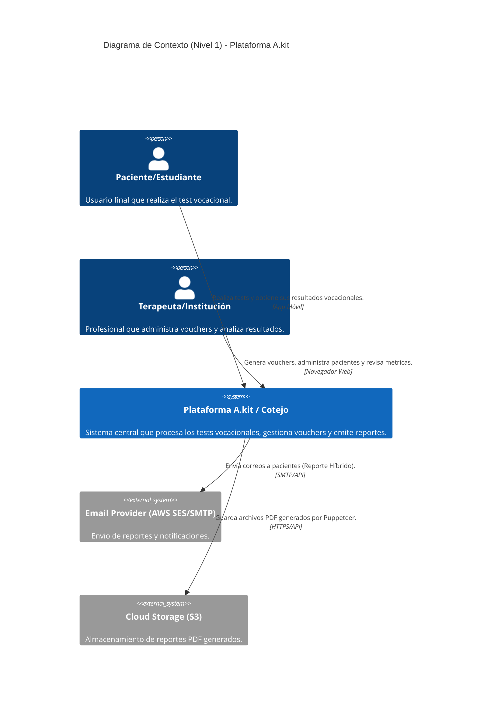
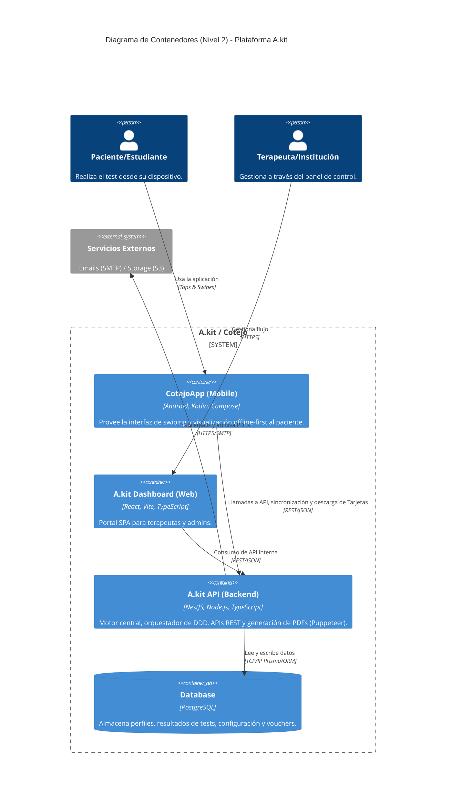

# Diagramas de Arquitectura (C4 Model)

A continuación se presentan los diagramas de arquitectura basados en el modelo C4 para el ecosistema A.kit / CotejoApp.

---

## Nivel 1: Diagrama de Contexto del Sistema

Muestra el sistema en su totalidad y cómo interactúa con los distintos actores (usuarios) y sistemas externos.



---

## Nivel 2: Diagrama de Contenedores

Zoom en el Sistema para ver las aplicaciones, bases de datos o microservicios que lo componen.



---

## Nivel 3: Diagrama de Componentes (A.kit API - Backend)

Detalle interno del contenedor principal (API Backend) resaltando la separación por Clean Architecture.

```mermaid
C4Component
    title Diagrama de Componentes (Nivel 3) - API Backend (NestJS)

    ContainerExt(mobileApp, "CotejoApp (Mobile)", "Cliente Android")
    ContainerExt(webApp, "A.kit Web", "Cliente React")
    ContainerDbExt(database, "PostgreSQL", "Data Store")

    Container_Boundary(api, "A.kit API Application") {
        Component(controllers, "REST Controllers", "NestJS @Controller", "Puntos de entrada HTTP (Rutas: Auth, Test, Vouchers, Reports).")
        
        System_Boundary(app_layer, "Capa de Aplicación (Use Cases)") {
            Component(uc_onboarding, "Onboarding Service", "TS Class", "Registra nuevos pacientes y emite tokens.")
            Component(uc_test_engine, "Test Engine Service", "TS Class", "Gestiona inicio de tests y registra swipes.")
            Component(uc_calc, "Result Calculator", "TS Class", "Aplica el algoritmo para sugerir perfiles e intereses vocacionales.")
            Component(uc_voucher, "Voucher Service", "TS Class", "Gestiona la acreditación B2B y cupones de un solo uso.")
            Component(uc_report, "Report Generator", "TS Class", "Integra Puppeteer para generar PDFs a partir de plantillas HTML.")
        }
        
        System_Boundary(domain_layer, "Capa de Dominio") {
            Component(domain_entities, "Entities & Aggregates", "TS Classes", "Modelos core: User, TestSession, VocationalResult, Voucher, Category.")
            Component(domain_repo_iface, "Repository Interfaces", "TS Interfaces", "Contratos para inyección de dependencias.")
        }
        
        System_Boundary(infra_layer, "Capa de Infraestructura") {
            Component(repo_impl, "Postgres Repositories", "TS Class (ORM)", "Implementa los repositorios (Ej. PrismaClient).")
            Component(email_service, "Email Client", "Nodemailer/SES", "Conector al servicio de correos externo.")
            Component(storage_service, "Cloud Storage Client", "AWS SDK S3", "Conector para subir archivos.")
        }
    }

    Rel(mobileApp, controllers, "Hace peticiones HTTPS", "JSON")
    Rel(webApp, controllers, "Hace peticiones HTTPS", "JSON")
    
    Rel(controllers, uc_onboarding, "Llama a")
    Rel(controllers, uc_test_engine, "Llama a")
    Rel(controllers, uc_calc, "Llama a")
    Rel(controllers, uc_voucher, "Llama a")
    Rel(controllers, uc_report, "Llama a")
    
    Rel(uc_test_engine, domain_entities, "Instancia entidades")
    Rel(uc_calc, domain_entities, "Instancia entidades")
    Rel(uc_onboarding, domain_entities, "Instancia entidades")
    
    Rel(uc_test_engine, domain_repo_iface, "Usa abstracciones para guardar")
    Rel(repo_impl, domain_repo_iface, "Implementa (DI)")
    Rel(repo_impl, database, "Ejecuta queries SQL", "Prisma/TypeORM")
    
    Rel(uc_report, email_service, "Envía template/email")
    Rel(uc_report, storage_service, "Sube PDF")
```
