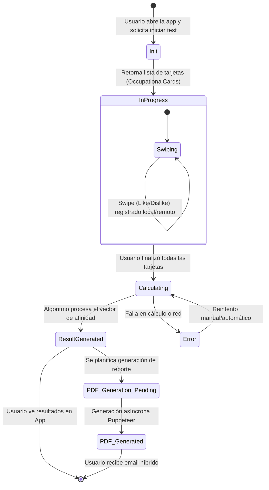
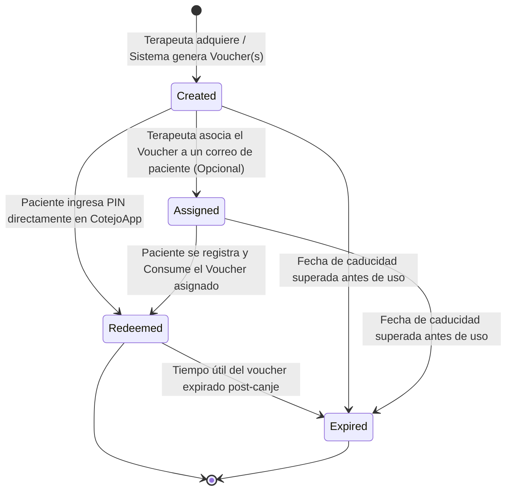
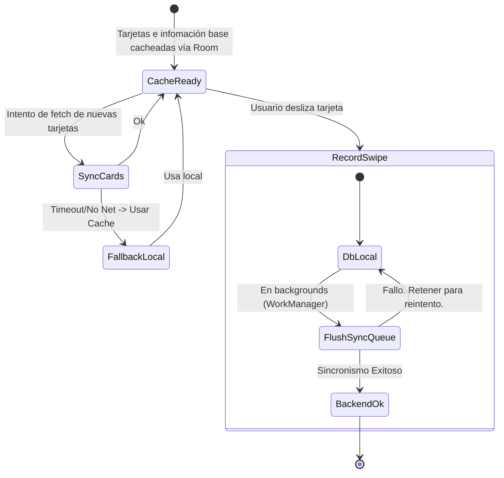

# Diagramas de Estados

A continuación se presentan los diagramas de estado (Mermaid `stateDiagram-v2`) que representan el ciclo de vida de los dominios principales de la plataforma.

---

## 1. Ciclo de Vida de una Sesión de Test (TestSession)

Describe el estado por el que pasa un test vocacional de un paciente desde su inicio hasta que se entregan sus resultados.

---

## 2. Ciclo de Vida de un Voucher (Monetización B2B)

Modelo para los terapeutas, instituciones o compras web de pines/tokens de evaluación.

---

## 3. Máquina de Estados de Sincronización Móvil (Offline-First)

Estados que maneja la App Android (Room DB + WorkManager) para el motor de tests.

