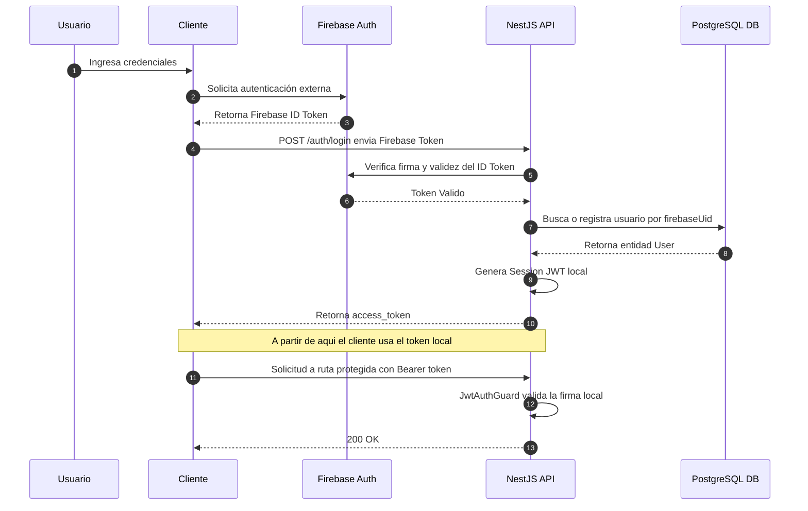

# Flujograma de Autenticación y Seguridad

Este documento detalla el mecanismo de autenticación utilizado en la plataforma A.kit, el cual delega la gestión de credenciales a Firebase Authentication y establece una confianza segura entre los clientes (Web/Mobile) y la API NestJS.

## Arquitectura de Seguridad

A.kit utiliza un modelo de autenticación híbrido:

1. **Firebase Auth** se encarga del alta de usuarios, recuperación de contraseñas y proveedores de identidad de terceros (Google Sign-In). Nuestra base de datos no almacena contraseñas.
2. **NestJS JWT Auth** se encarga de proteger los endpoints locales y mantener el estado de los roles (Estudiante, Admin).

## Flujo de Autenticación Principal (Login)

## Beneficios de este Enfoque
- **Delegación de Riesgos:** No guardamos contraseñas, reduciendo drásticamente la superficie de ataque para fugas de datos.
- **Independencia Operativa:** Una vez que el usuario canjea el token de Firebase por nuestro token local (`access_token`), nuestras validaciones por request no requieren hacer llamadas de red externas a Firebase, lo que disminuye la latencia a `0ms` extra por request.
- **Manejo de Roles Custom:** Mientras Firebase ignora los permisos internos de nuestro negocio, el JWT local incluye los `roles` autorizados que los Guards de NestJS procesan nativamente (`@Roles('ADMIN')`).
