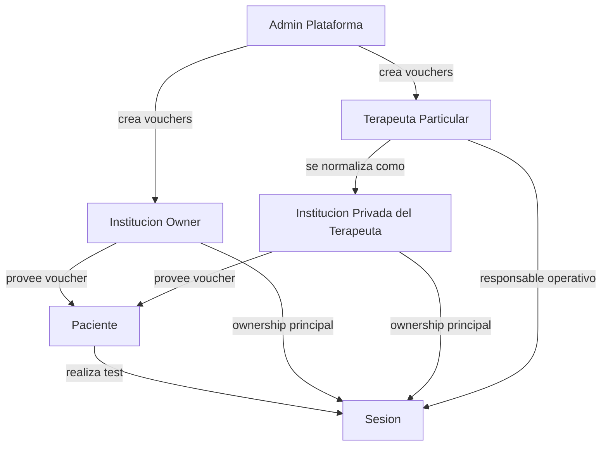

# MVP Ownership y Permisos

Fecha de referencia: `2026-03-27`

## 1. Objetivo

Este documento fija las reglas MVP para:

- ownership de vouchers;
- ownership de sesiones;
- permisos de acceso por actor;
- alcance funcional de institución, terapeuta y paciente;
- límites explícitos de lo que no entra todavía en esta fase.

La intención es que backend, app Android y panel web trabajen con la misma regla de negocio.

---

## 2. Decisión central del modelo

En el MVP, el dueño funcional de un voucher y de la sesión generada a partir de ese voucher se modela como un **owner institucional**.

Esto significa:

- una institución formal puede ser owner;
- un terapeuta particular también se modela como owner institucional, mediante su consultorio/institución privada;
- el campo principal de ownership es `ownerInstitutionId`;
- `ownerUserId` o `therapistUserId` representan al responsable operativo, no al dueño principal del caso.

---

## 3. Definiciones MVP

## 3.1 Owner institucional

Es la entidad que:

- compra o recibe vouchers desde plataforma;
- administra esos vouchers;
- recibe ownership principal de las sesiones realizadas con esos vouchers;
- visualiza esos casos en web.

Puede ser:

- una institución propiamente dicha;
- un terapeuta individual modelado como institución privada.

## 3.2 Terapeuta responsable

Es el usuario operativo asociado a una institución.

En el MVP:

- cada institución tiene un solo terapeuta;
- por eso terapeuta e institución comparten casi siempre la misma visibilidad funcional;
- más adelante podrán existir múltiples terapeutas dentro de la misma institución.

## 3.3 Paciente

En el MVP el paciente:

- no usa la web;
- interactúa sólo desde Android;
- ve el resultado inmediato del test en la app;
- eventualmente recibe o desbloquea el informe según pago o voucher.

No se construye todavía historial web del paciente.

---

## 4. Matriz de Permisos MVP

## 4.1 Matriz principal

| Actor | Canal | Ve vouchers | Ve sesiones | Ve informe | Crea vouchers | Observaciones |
|---|---|---|---|---|---|---|
| Admin plataforma | Web | Sí, todos | Sí, todas | Sí | Sí | actor global |
| Institución | Web | Sí, sólo los propios | Sí, sólo las sesiones de su institución | Sí, de su institución | No | owner principal del caso |
| Terapeuta responsable | Web | Sí, los de su institución | Sí, las sesiones de su institución | Sí, de su institución | No | en MVP equivale funcionalmente a la institución |
| Paciente | Android | No | Sólo resultado inmediato de su test actual | Sí, si corresponde por pago o voucher | No | no tiene historial web |

## 4.2 Matriz de endpoints

| Endpoint | Admin | Institución | Terapeuta | Paciente |
|---|---|---|---|---|
| `POST /auth/login` | Sí | según evolución futura | según evolución futura | No aplica |
| `POST /users/register` | Sí / sistema | Sí / sistema | Sí / sistema | Sí / sistema |
| `POST /vouchers` | Sí | No | No | No |
| `POST /vouchers/resolve` | Sí | Sí | Sí | Sí |
| `GET /sessions` | Sí, todo | Sí, sólo su institución | Sí, sólo su institución | No en web MVP |
| `GET /sessions/:id` | Sí, todo | Sí, sólo su institución | Sí, sólo su institución | No en web MVP |
| `POST /sessions/complete` | Sí / sistema | Sí / sistema | Sí / sistema | Sí / sistema |
| `POST /sessions/:id/send-report` | Sí | Sí, sólo su institución | Sí, sólo su institución | Se invoca desde Android según flujo |

---

## 5. Reglas de negocio por flujo

## 5.1 Test individual sin voucher

Caso:

- el paciente hace el test por su cuenta;
- no interviene una institución externa;
- puede luego pagar o no pagar el informe.

Reglas:

- `sessions.patient_id` = usuario paciente;
- `sessions.voucher_id` = `null`;
- `sessions.therapist_user_id` = owner interno configurado por plataforma;
- `sessions.institution_id` = institución operativa interna si existe;
- el paciente ve el resultado inmediato en Android;
- no se construye historial web del paciente en el MVP.

## 5.2 Test con voucher institucional

Caso:

- un voucher pertenece a una institución owner;
- el paciente usa ese voucher;
- la sesión pasa a la institución owner.

Reglas:

- `sessions.patient_id` = usuario paciente;
- `sessions.voucher_id` = voucher utilizado;
- `sessions.institution_id` = `vouchers.owner_institution_id`;
- `sessions.therapist_user_id` = terapeuta responsable si existe;
- `sessions.payment_status` = `VOUCHER_REDEEMED`;
- `vouchers.status` = `USED`;
- `vouchers.redeemed_session_id` = sesión creada.

## 5.3 Test con terapeuta particular

Caso:

- un terapeuta independiente compra o recibe vouchers;
- no opera bajo una institución compleja;
- debe unificarse el criterio con el resto del sistema.

Reglas:

- el terapeuta se modela como owner institucional mediante una institución privada;
- el voucher queda asociado a esa institución privada;
- la sesión queda asociada a esa institución privada;
- el terapeuta queda como responsable operativo del caso.

En términos de persistencia:

- `vouchers.owner_type = INSTITUTION`
- `vouchers.owner_institution_id = institucion_privada_del_terapeuta`
- `vouchers.owner_user_id = terapeuta_responsable`
- `sessions.institution_id = institucion_privada_del_terapeuta`
- `sessions.therapist_user_id = terapeuta_responsable`

---

## 6. Alcance MVP explícito

Sí entra en MVP:

- ownership institucional único;
- un terapeuta por institución;
- vouchers creados por admin plataforma;
- institución consulta sus vouchers;
- institución consulta sus sesiones;
- terapeuta consulta los mismos casos de su institución;
- paciente ve resultado inmediato en Android;
- informe por pago o voucher.

No entra todavía en MVP:

- historial web del paciente;
- múltiples terapeutas por institución;
- permisos diferenciados entre varios terapeutas de una misma institución;
- subasignación de vouchers entre terapeutas;
- reasignación interna de subconjuntos de vouchers;
- bandeja clínica compleja;
- trazabilidad fina de transferencias internas de ownership.

---

## 7. Lotes de vouchers

En este MVP, `voucher_batch` debe entenderse como:

- lote de compra;
- lote de carga;
- lote emitido por plataforma para una institución owner.

No debe entenderse todavía como:

- subconjunto reasignado entre terapeutas;
- reparto interno entre varios profesionales.

## 7.1 Regla MVP

- el admin plataforma crea vouchers para una institución;
- esos vouchers quedan bajo ownership de esa institución;
- la institución los consume operativamente;
- no existe todavía redistribución interna entre terapeutas.

## 7.2 Evolución futura

Cuando exista más de un terapeuta por institución, se podrá agregar una capa nueva:

- `voucher_allocations`
- o `assigned_therapist_user_id`
- o una tabla de movimientos internos

para representar:

- cuántos vouchers del total se asignan a cada terapeuta;
- qué terapeuta puede usar o gestionar cada voucher;
- auditoría de reasignaciones internas.

Eso queda fuera del MVP actual.

---

## 8. Reglas recomendadas de implementación backend

## 8.1 Listado de sesiones

`GET /sessions`

- `ADMIN`: devuelve todo.
- actor institucional o terapeuta institucional: devuelve sólo sesiones con `institution_id = actor.institutionId`.
- paciente: no se expone como historial web en MVP.

## 8.2 Lectura de sesión puntual

`GET /sessions/:id`

- `ADMIN`: acceso total.
- actor institucional o terapeuta institucional: sólo si `session.institution_id = actor.institutionId`.
- paciente: no exponer en web en MVP.

## 8.3 Creación de vouchers

`POST /vouchers`

- sólo admin plataforma;
- recibe ownership en formato `ownerType`, `ownerUserId`, `ownerInstitutionId`;
- si el input refiere a terapeuta individual, el sistema lo normaliza a owner institucional.

## 8.4 Resolución de vouchers

`POST /vouchers/resolve`

- puede ser usado para validar código antes del test;
- debe responder sólo con datos necesarios para validación y ownership;
- si el voucher no está disponible, debe devolver error con mensaje explícito.

---

## 9. Diagrama simple de ownership

---

## 10. Decisión final de este documento

Para el MVP:

1. no existe historial web del paciente;
2. el paciente opera sólo en Android;
3. la institución tiene un solo terapeuta;
4. los vouchers los crea el admin de plataforma;
5. la institución no reasigna todavía vouchers entre múltiples terapeutas;
6. el ownership principal del voucher y de la sesión es institucional;
7. el terapeuta es actor operativo responsable dentro de esa institución.

Este documento debe usarse como referencia para permisos, endpoints y futuras iteraciones del panel web.
