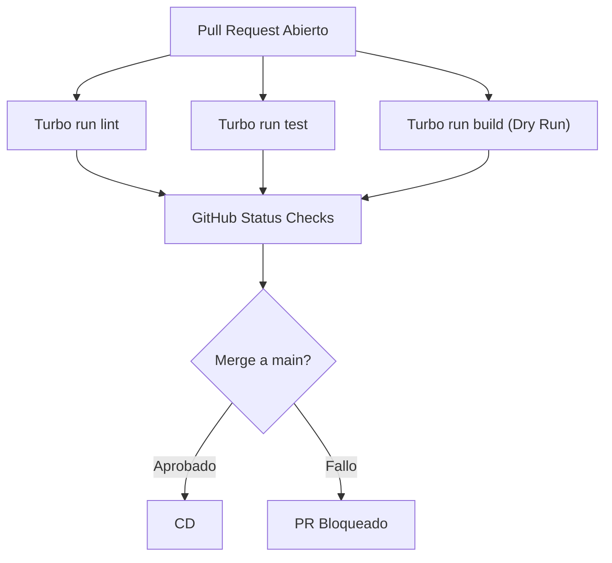

# Flujos de Despliegue y CI/CD

La plataforma A.kit utiliza un enfoque de Integración Continua (CI) y Entrega Continua (CD) basado en repositorios monorepo (Turborepo), automatizado mediante GitHub Actions y desplegado en proveedores cloud modernos.

## Arquitectura de Orquestación (Turborepo)

Dado que tenemos múltiples aplicaciones (`apps/api`, `apps/web`, `apps/site`) y paquetes (`packages/contracts`, `packages/design-tokens`), utilizamos **Turborepo** para optimizar los tiempos de build.
- **Caché Remota:** Turborepo cachea los resultados de las tareas (`build`, `test`, `lint`). Si un paquete no ha cambiado, no se vuelve a construir.
- **Pipeline de Ejecución:** `pnpm turbo run build` respeta las dependencias topológicas (por ejemplo, compila `contracts` antes que `api`).

## Flujo de Integración Continua (CI)

Se ejecuta automáticamente en cada Pull Request hacia la rama `main`.

## Flujo de Entrega Continua (CD)

El CD está distribuido en múltiples plataformas especializadas según la naturaleza de la aplicación. Ocurre automáticamente al hacer un merge a la rama `main`.

1. **Frontend (apps/web y apps/site) -> Vercel**
   - Vercel detecta los cambios en la rama `main` a través de su integración nativa con GitHub.
   - Aplica el comando de build configurado (`npx turbo run build --filter=web...`).
   - Sube los artefactos estáticos (HTML/CSS/JS) a la CDN Global de Vercel.

2. **Backend (apps/api) -> Render PaaS**
   - Utilizamos un archivo `render.yaml` (Infrastructure as Code) para definir los servicios.
   - Al detectar un cambio en `main`, Render ejecuta la fase de build (`pnpm install && pnpm turbo run build --filter=api`).
   - Se aplican las migraciones de TypeORM automáticamente.
   - Despliegue sin tiempo de inactividad (Zero-Downtime Deployment).

3. **Base de Datos -> Neon DB (PostgreSQL Serverless)**
   - El backend en Render se conecta a Neon DB.
   - Las migraciones de esquema son controladas por el ORM durante el inicio del servicio (`npm run start:prod`).

## Manejo de Secretos y Variables de Entorno
- Los secretos locales se gestionan mediante archivos `.env` (ignorados en git).
- Los secretos de Producción están inyectados directamente en los paneles de control de Render (para la API) y Vercel (para los frontends). No utilizamos GitHub Secrets para el CD final ya que los proveedores Cloud extraen el código directamente.
