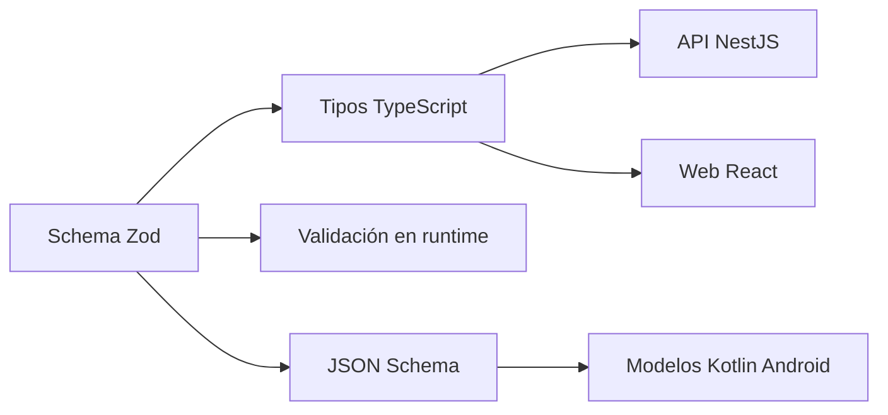
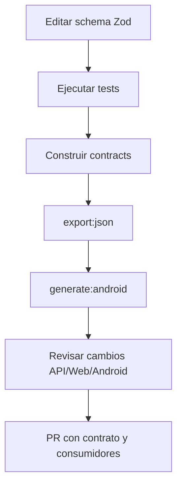
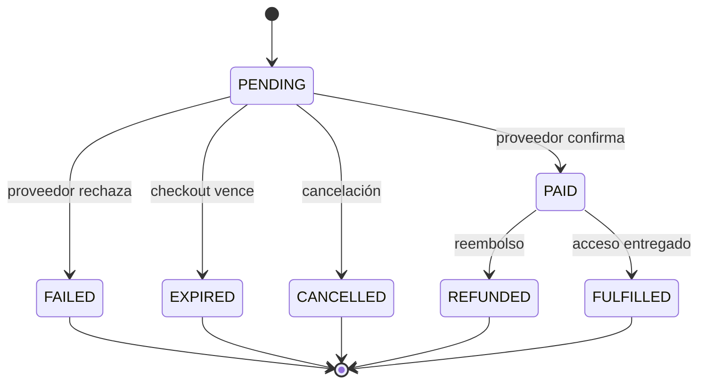
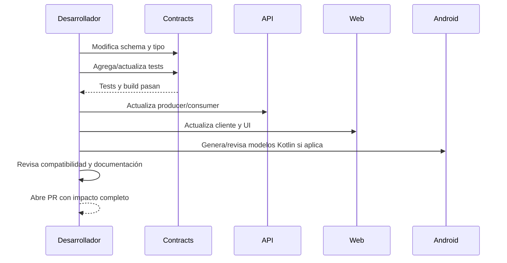

# Contratos compartidos

`packages/contracts` define la forma de los datos que intercambian API, Web y la aplicación Android. Es la fuente de verdad para schemas Zod, tipos TypeScript y los modelos derivados que consumen otros clientes.

## Qué problema resuelve

Sin contratos compartidos, cada cliente puede interpretar de forma distinta un mismo payload: un estado, una fecha, un importe o un error. El paquete centraliza esas reglas y permite validar los datos en los límites del sistema.



## Estructura

| Archivo / área                    | Responsabilidad                                       |
| --------------------------------- | ----------------------------------------------------- |
| `packages/contracts/src/index.ts` | Export público del paquete.                           |
| `auth.ts`                         | Contratos de identidad, login y tokens.               |
| `sessions.ts`                     | Sesiones, resultados y respuestas relacionadas.       |
| `vouchers.ts`                     | Vouchers, batches, redeem y listados.                 |
| `payments.ts`                     | Gateways, checkout, estados, historial y remediación. |
| `reports/`                        | Contratos de reportes y acceso.                       |
| `institutions.ts`                 | Instituciones y datos relacionados.                   |
| `categories.ts`                   | Categorías vocacionales.                              |
| `common.ts`                       | Errores y estructuras comunes.                        |
| `errors.schemas.ts`               | Schemas de errores de API.                            |
| `export-json-schemas.ts`          | Export seleccionado de schemas a JSON Schema.         |
| `generate-android-models.ts`      | Generación de modelos Kotlin mediante quicktype.      |
| `src/__tests__/`                  | Pruebas de schemas y comportamiento contractual.      |

El consumidor debe importar desde `@akit/contracts`, no desde rutas internas del paquete.

## Pipeline de generación



Comandos desde la raíz:

```powershell
pnpm --filter @akit/contracts test
pnpm --filter @akit/contracts build
pnpm --filter @akit/contracts generate:android
```

`generate:android` ejecuta primero `export:json` y luego genera `VoucherContracts.kt` en el repositorio hermano `CotejoApp`. Verificá que ese repositorio exista en la ubicación esperada antes de ejecutar el comando.

## Cómo definir un contrato

Un contrato debe:

1. Usar un schema Zod exportado con un nombre estable.
2. Derivar su tipo con `z.infer` cuando corresponda.
3. Rechazar campos inesperados cuando el payload sea cerrado, usando `.strict()`.
4. Definir formatos explícitos para UUID, fechas, monedas, estados y referencias externas.
5. Tener pruebas para payload válido, payload inválido y casos límite.
6. Exportarse desde `src/index.ts` si es parte de la API pública del paquete.

Ejemplo conceptual:

```typescript
export const ExampleResponse = z
  .object({
    id: z.string().uuid(),
    status: z.enum(["PENDING", "DONE"]),
    createdAt: z.string().datetime(),
  })
  .strict();

export type ExampleResponse = z.infer<typeof ExampleResponse>;
```

La validación de TypeScript ocurre en compilación; `ExampleResponse.parse(payload)` o `safeParse(payload)` es la validación de runtime. No asumir que un tipo TypeScript valida datos recibidos por HTTP.

## Contratos de pagos

`payments.ts` contiene estados y payloads que deben permanecer coordinados entre proveedores:



Los estados de pago, fulfillment y freshness son dimensiones diferentes. No reemplazar una por otra: un pago puede estar `PAID` mientras su fulfillment todavía está `QUEUED`, o puede tener información del proveedor `STALE`.

`CommercialSnapshot` también conserva una variante `LEGACY_PARTIAL`. No eliminarla sólo porque parezca antigua: primero hay que localizar consumidores, migrarlos y aprobar su remoción separadamente.

## Compatibilidad de cambios

### Compatibles normalmente

- Agregar un endpoint nuevo.
- Agregar un estado nuevo si todos los consumidores toleran valores desconocidos.
- Agregar un campo opcional con comportamiento documentado.
- Agregar un schema nuevo sin cambiar los existentes.

### Potencialmente incompatibles

- Renombrar o eliminar un campo.
- Cambiar un campo requerido a otro tipo.
- Cambiar el formato de una fecha, moneda, UUID o referencia.
- Eliminar un estado o modificar su significado.
- Cambiar un discriminador como `providerFreshness` o `kind`.
- Hacer obligatorio un campo que clientes existentes no envían.
- Cambiar `.strict()` o las reglas de una refinación de forma que rechace payloads antes válidos.

Cuando un cambio es incompatible, usar una nueva versión o una estrategia de migración. No esconder un breaking change detrás de un ajuste de implementación.

## Procedimiento para cambiar un contrato



Checklist de PR:

- [ ] El cambio parte del schema en `packages/contracts`.
- [ ] Se actualizaron tests de éxito, error y borde.
- [ ] Se revisaron todos los consumidores del contrato.
- [ ] Se ejecutó `pnpm --filter @akit/contracts test`.
- [ ] Se ejecutó `pnpm --filter @akit/contracts build`.
- [ ] Se ejecutó `pnpm --filter @akit/contracts generate:android` cuando aplica.
- [ ] Se revisó el diff generado en Android.
- [ ] Se documentó si el cambio es compatible, migratorio o breaking.
- [ ] API, Web y Android se pueden compilar con el nuevo contrato.

## Errores y validación

Los errores de API deben conservar una forma estable y legible por clientes. Un mensaje humano puede cambiar; el código de error y la estructura deben ser tratados como contrato.

Para cada error nuevo documentar:

- Código estable.
- HTTP status.
- Campos adicionales.
- Condición que lo dispara.
- Si el cliente puede reintentar.
- Ejemplo sanitizado de respuesta.

No incluir tokens, stack traces, credenciales ni datos personales en ejemplos.

## Límites actuales del pipeline

- `export-json-schemas.ts` exporta un conjunto seleccionado de schemas, no todo el contenido del paquete.
- `generate-android-models.ts` usa muestras JSON para quicktype; no es una traducción automática completa de todas las refinaciones Zod.
- Las refinaciones complejas, como consistencia entre `missingFields` y campos nulos, deben estar cubiertas por tests y documentadas para los consumidores.
- El generador Android escribe en un repositorio hermano; una generación exitosa no garantiza por sí sola que Android compile.

## Reglas para futuros desarrolladores

1. El schema es el contrato; el controlador no debe inventar una forma distinta.
2. Un tipo TypeScript no reemplaza la validación de runtime.
3. Los cambios de contrato se revisan como cambios multiplataforma.
4. Los estados deben tener significado documentado y transición verificable.
5. Los contratos legacy se eliminan sólo después de migrar consumidores y aprobar su retiro.
6. Los ejemplos deben ser ficticios y mínimos.
7. Si una regla no puede expresarse en el schema, agregar una prueba explícita y documentar la razón.

## Referencias

- [Arquitectura de la plataforma](architecture.md)
- [Primer día de desarrollo](getting-started.md)
- [Roadmap de documentación](documentation-roadmap.md)
