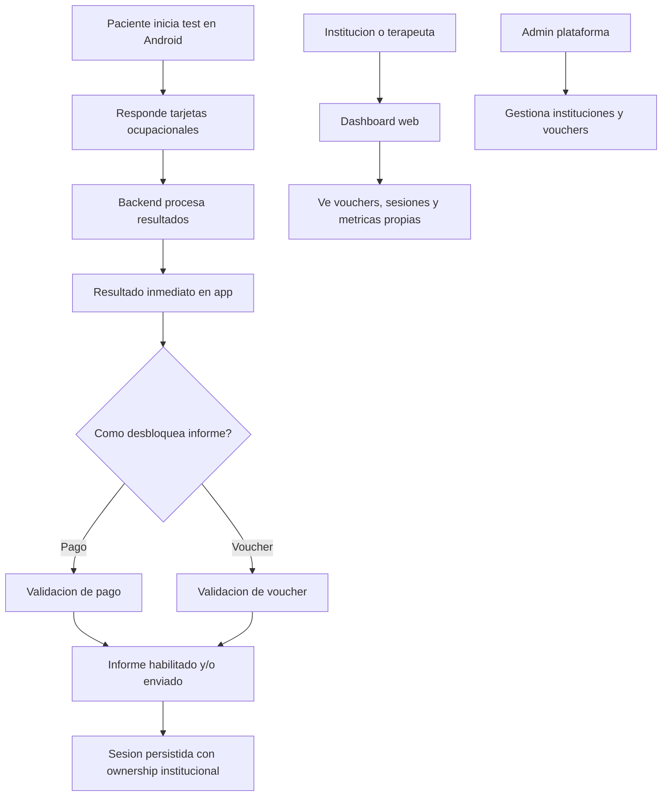

# Core de negocio de A.kit

## Resumen ejecutivo

A.kit es una plataforma de evaluación vocacional con enfoque de Terapia Ocupacional. Permite que un paciente complete un test interactivo, obtenga un resultado inmediato y desbloquee un informe completo por pago o voucher.

La solución se apoya en tres componentes:

- App Android: experiencia del paciente.
- API Backend: lógica de negocio, persistencia, seguridad y reglas comerciales.
- App Web: gestión operativa para admin e instituciones.

Objetivo de negocio en MVP:

- entregar una experiencia clara al paciente;
- asegurar control de vouchers, sesiones e informes;
- segmentar datos por ownership institucional;
- habilitar crecimiento hacia analítica y operación escalable.

## Alcance funcional (versión extendida)

### 1. Flujo principal del paciente

1. El paciente inicia sesión en Android y comienza el test.
2. Visualiza tarjetas ocupacionales categorizadas.
3. Marca cada tarjeta como "me gusta" o "no me gusta" (gesto o botón).
4. El sistema procesa respuestas y calcula afinidad por áreas.
5. La app muestra resultado inmediato (áreas de mayor y menor afinidad).
6. El paciente desbloquea informe completo mediante:
   - pago individual; o
   - voucher de institución/terapeuta.

### 2. Responsabilidades por componente

#### App Android

- Ejecutar el test de punta a punta.
- Mostrar resultado resumido al finalizar.
- Permitir solicitud o desbloqueo del informe.
- Sincronizar datos de sesión con backend.

Datos operativos esperados:

- resultado del test;
- duración total;
- tiempo de respuesta por tarjeta;
- cambios de decisión del paciente;
- estado de desbloqueo del informe (pago o voucher).

#### API Backend

- Actuar como fuente de verdad del dominio.
- Persistir sesiones, resultados y swipes.
- Gestionar autenticación y autorización por rol.
- Administrar vouchers e instituciones.
- Resolver reglas de desbloqueo y envío de informe.

#### App Web

- Proveer dashboard operativo para actores autorizados.
- Visualizar vouchers, sesiones y métricas dentro de permisos.
- Dar soporte de gestión al rol admin.

### 3. Actores y permisos (MVP)

#### Paciente

- Usa exclusivamente Android.
- Realiza test y ve resultado inmediato.
- Obtiene informe por pago o voucher.
- No accede al dashboard web.

#### Institución / terapeuta

- Accede al dashboard web.
- Gestiona vouchers bajo su ownership institucional.
- Ve sesiones, métricas e informes de su propio ámbito.
- No puede acceder a casos de otras instituciones.

Nota: en el MVP, un terapeuta individual se modela como institución privada para mantener consistencia de ownership.

#### Admin de plataforma

- Gestiona instituciones y terapeutas (CRUD).
- Crea y asigna vouchers.
- Tiene visión global operativa según reglas vigentes del MVP.

### 4. Regla central de ownership

- El ownership principal de voucher y sesión se modela por institución (`ownerInstitutionId`).
- Si un paciente usa voucher, la sesión queda asignada a la institución dueña de ese voucher.
- Esta regla sostiene el control de acceso y la trazabilidad por institución.

## Diagrama de flujo (MVP)

## Resultado esperado

Este core define un producto viable con equilibrio entre experiencia clínica, control operativo y base técnica escalable. En términos prácticos, permite lanzar con reglas claras de acceso, propiedad de datos y monetización del informe, sin comprometer la evolución futura del sistema.
