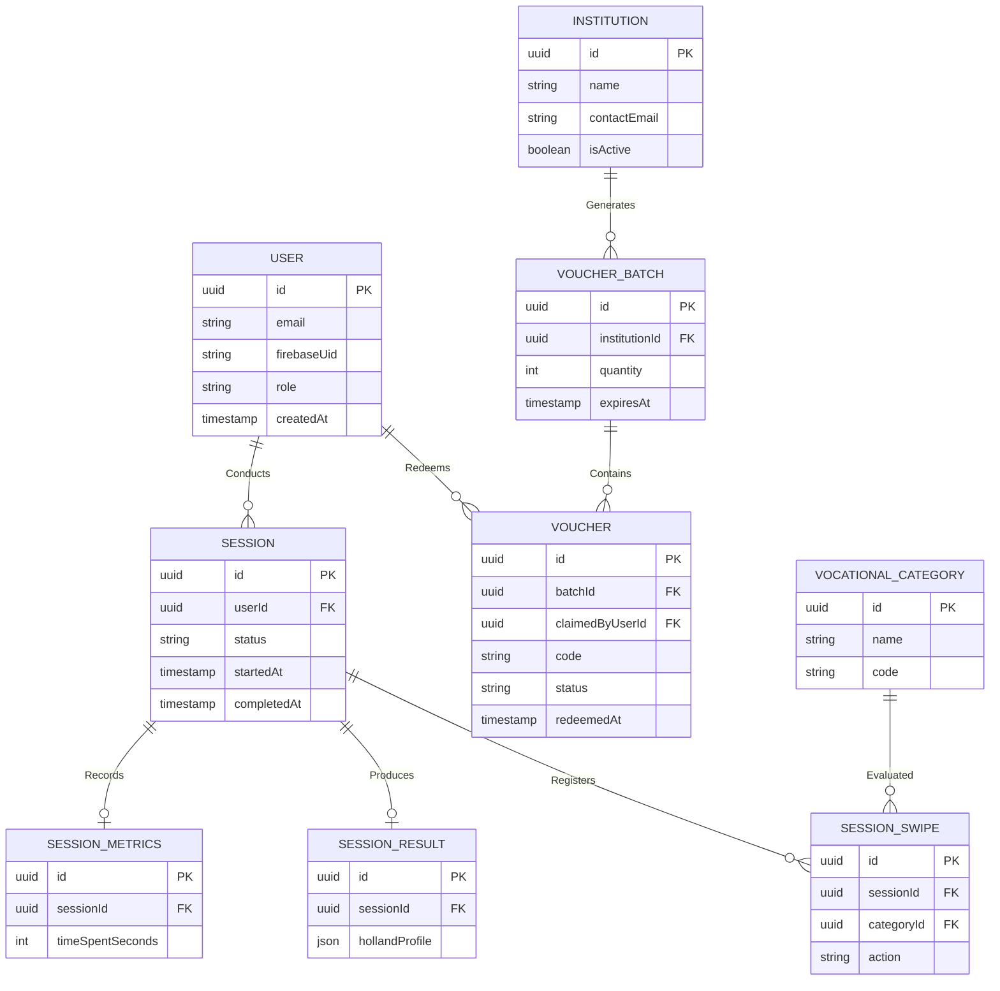

# Diagrama Entidad-Relación (ERD)

Este documento mapea la estructura relacional de la base de datos PostgreSQL, representando cómo interactúan las principales entidades de la plataforma utilizando TypeORM.

## Notas Arquitectónicas
- **Autenticación Delegada:** La entidad `USER` no guarda contraseñas. Depende enteramente de `firebaseUid` delegado a Google/Firebase Auth.
- **Redención B2B:** Cuando un `VOUCHER` cambia de estado a `REDEEMED`, se enlaza al `USER` a través del campo `claimedByUserId`. Esto permite trazabilidad para la institución que compró el `VOUCHER_BATCH`.
- **Inmutabilidad Parcial:** Los registros en `SESSION_SWIPE` y `SESSION_RESULT` deben ser tratados como inmutables una vez que la sesión pasa al estado `COMPLETED`.
