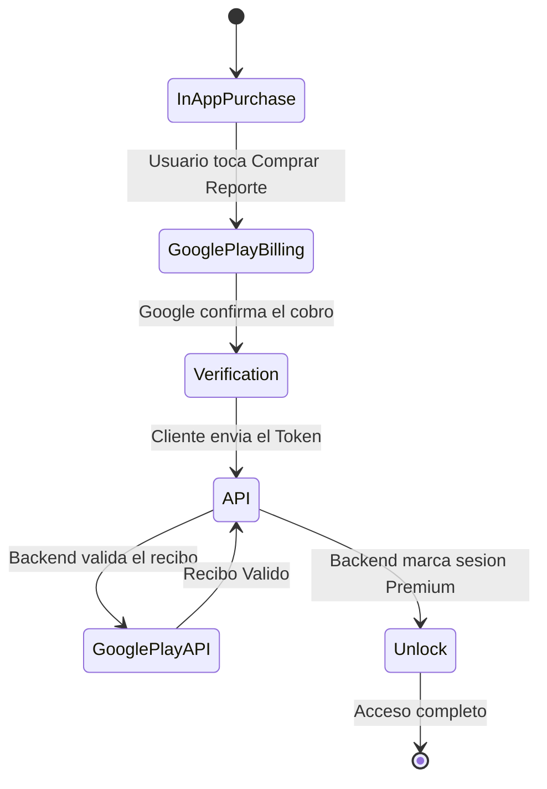
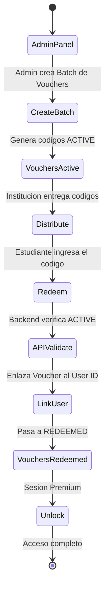

# Flujos de Monetización

La plataforma A.kit opera con un modelo de doble entrada para la monetización: un enfoque **B2C** directo al usuario a través de tiendas de aplicaciones, y un enfoque **B2B** orientado a compras corporativas o institucionales.

## Modelo B2C (Directo al Consumidor)

Este flujo ocurre cuando un estudiante descarga la aplicación de manera orgánica y decide abonar por un reporte completo desde la app.

*Nota técnica:* Para evitar fraude (compras falsificadas), nunca confiamos en el cliente. El backend siempre verifica el recibo contra los servidores de Google antes de otorgar acceso.

---

## Modelo B2B (Vouchers Institucionales)

Este flujo ocurre cuando una institución (colegio, municipalidad) compra accesos al por mayor para sus alumnos, evitando el pago individual in-app.

## Diferencias Estructurales en Código

1. **Dependencia de Red:** El B2C requiere hablar con la API de Google Play en el backend. El B2B se procesa 100% en nuestra base de datos local mediante transacciones transaccionales ACID en PostgreSQL.
2. **Propiedad:** Un pago B2C desbloquea el reporte, pero el dinero ingresa por la tienda (sujeto a 15-30% de fee). El B2B implica un cobro "off-platform" (facturación tradicional al colegio) y el código actúa como un cupón del 100% de descuento.
