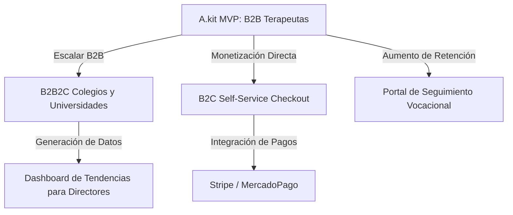

# 📊 Auditoría de Optimización y Estrategia de Crecimiento: A.kit Platform

---

## 🏛️ 1. Auditoría Técnica y Arquitectónica: De MVP a Escala de Producción

Para que la plataforma soporte un crecimiento masivo sin degradar el rendimiento ni acumular deuda técnica insostenible, debemos fortalecer los cimientos asumiendo buenas prácticas de **SOLID** y arquitectura hexagonal.

### ⚙️ 1.1 Robustez de Infraestructura y Procesamiento
*   **Consolidar el Patrón Productor-Consumidor (Colas Reales)**:
    *   *Estado actual*: Los envíos de mails de invitación, resets y códigos se procesan *in-process* en memoria para subsanar la falta de Workers.
    *   *Propuesta*: Implementar el `EmailQueueWorker` asíncrono y distribuido en Redis (detallado en la deuda técnica). Esto aislará los fallos del servidor SMTP/Resend de la disponibilidad de la API REST.
*   **Aislamiento del Motor de Generación de PDFs**:
    *   *Estado actual*: Puppeteer se levanta dentro del mismo proceso de la API NestJS para renderizar los informes PDF.
    *   *Riesgo*: Puppeteer consume memoria RAM de forma masiva y agresiva. Una ráfaga de 50 usuarios descargando PDFs en simultáneo puede causar un *Out Of Memory (OOM)* y tirar abajo toda la API.
    *   *Propuesta*: Extraer el `PdfService` a un microservicio serverless dedicado (ej. AWS Lambda o un contenedor aislado en Render/Docker) especializado únicamente en generar PDFs mediante Chrome Headless.

### 🗄️ 1.2 Capa de Datos y Base de Datos (Postgres + Redis)
*   **Optimización de Índices de Lectura**:
    *   El motor del test registra transacciones rápidas (swipes). Conforme crezcan las sesiones, la tabla `swipes` tendrá millones de filas.
    *   *Acción*: Crear índices compuestos sobre `(sessionId, cardId)` en `swipes` e índices parciales en `results` por `hollandCode` para acelerar el módulo de analíticas.
*   **Estrategia de Caché de Dos Niveles**:
    *   Implementar un caché en Redis con invalidación automática para las consultas repetitivas de instituciones y estadísticas agregadas (`apps/api/src/stats/`).

---

## 🧠 2. Auditoría Clínica y Experiencia de Usuario (UX)

A.kit no es un "test de revista", es una herramienta de diagnóstico clínico vocacional. El valor que le aporta al terapeuta debe ser sobresaliente.

### 📈 2.1 Enriquecimiento de Métricas Conductuales (Behavioral Metrics)
*   **Hesitation Index (Índice de Duda)**:
    *   *Concepto*: Registrar no solo el promedio de velocidad por swipe, sino identificar las cartas exactas donde el paciente tardó más de 5 segundos en decidir.
    *   *Utilidad clínica*: Revela "zonas de conflicto cognitivo" (ej. el paciente tarda mucho en decidir si le gusta 'Programación', lo que indica un deseo en conflicto con un prejuicio social).
*   **Distracción y Foco de Sesión**:
    *   *Concepto*: Medir los eventos de pérdida de foco en la pestaña del navegador (usando la API `visibilitychange`).
    *   *Utilidad clínica*: Informar al terapeuta si el paciente completó el test concentrado de un tirón o si estuvo cambiando de pestaña / distrayéndose, lo que altera la validez del *Fatigue Curve*.

### 🤖 2.2 Copiloto de Inteligencia Artificial Clínico (Therapist AI Co-Pilot)
*   **Generador Asistido de Notas de Sesión**:
    *   *Feature*: Integrar un modelo de lenguaje (ej. Gemini/Claude) para procesar las métricas puras de la sesión (Holland Code, velocidad de reacción, desvíos, cartas dudosas) y redactar un borrador de informe clínico-pedagógico para el terapeuta.
    *   *Valor*: El terapeuta ahorra el 80% del tiempo de redacción y solo debe revisar, pulir y firmar.

---

## 🚀 3. Features de Negocio para el Crecimiento (Growth & Scale)

Para transformar la plataforma en un producto SaaS altamente monetizable, sugerimos habilitar los siguientes vectores de crecimiento:

### 🏫 3.1 Escalamiento B2B2C: Módulo para Instituciones Educativas (Colegios/Universidades)
*   **Casos de Uso**:
    *   Un colegio secundario compra un lote de 200 vouchers para toda la camada de último año.
    *   El orientador escolar del colegio da de alta la sesión y los alumnos completan el test de forma masiva en la sala de computación.
*   **Features Necesarias**:
    *   **Dashboard de Tendencias Agregadas para el Orientador**: Un panel que consolida los perfiles dominantes del grupo (ej. *"El 60% de la camada 2026 tiene un perfil Social-Artístico"*).
    *   **Importación Masiva de Alumnos**: Subir un Excel de alumnos para generar y asignar vouchers automáticamente por correo electrónico.

### 💳 3.2 Canal B2C: Auto-Servicio y Pasarela de Pagos (Self-Service)
*   **Casos de Uso**:
    *   Un joven o adulto en reorientación laboral entra a la Landing Page pública y quiere hacer el test sin mediación obligatoria de un terapeuta para obtener un informe express.
*   **Features Necesarias**:
    *   **Pasarela de Pago Integrada (Stripe / MercadoPago)**: Permite pagar el test unitario directamente desde la landing page.
    *   **Flujo Autónomo**: Tras el pago exitoso, la API genera el voucher asíncronamente, redirige al test y envía el reporte detallado al mail del comprador al finalizar.

### 🗺️ 3.3 Integración con Bases de Datos de Trabajo y Carreras Reales
*   **Casos de Uso**:
    *   El informe actual te da el código Holland (ej. RIASEC), pero no te dice exactamente dónde estudiar ni qué salida laboral tiene hoy en tu país.
*   **Features Necesarias**:
    *   **Mapeo de Carreras Locales**: Conectar los códigos Holland con bases de datos del mercado laboral y planes de estudio universitarios locales.
    *   *Ejemplo*: Si tu perfil es "Investigador-Realista (IR)", la plataforma te lista carreras universitarias recomendadas activas en tu región e instituciones que las dictan.

### 📱 3.4 Portal del Estudiante (Retention & Engagement)
*   **Casos de Uso**:
    *   Actualmente el test es un evento único. El paciente lo hace, le llega el PDF y nunca más vuelve a entrar a la plataforma.
*   **Features Necesarias**:
    *   **El Portal de Exploración**: Darle acceso de por vida al paciente a un panel interactivo donde puede ver la evolución de sus intereses a lo largo del tiempo (si repite el test), guardar carreras favoritas, chatear con su terapeuta y recibir artículos educativos adaptados a su perfil vocacional.
