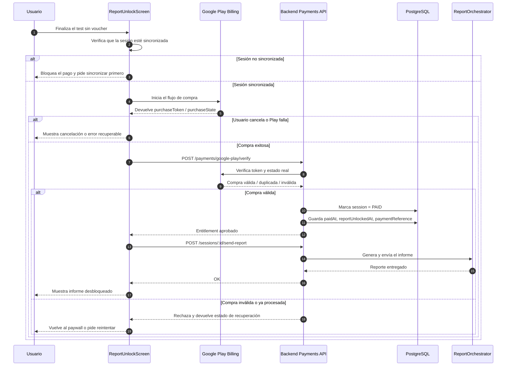
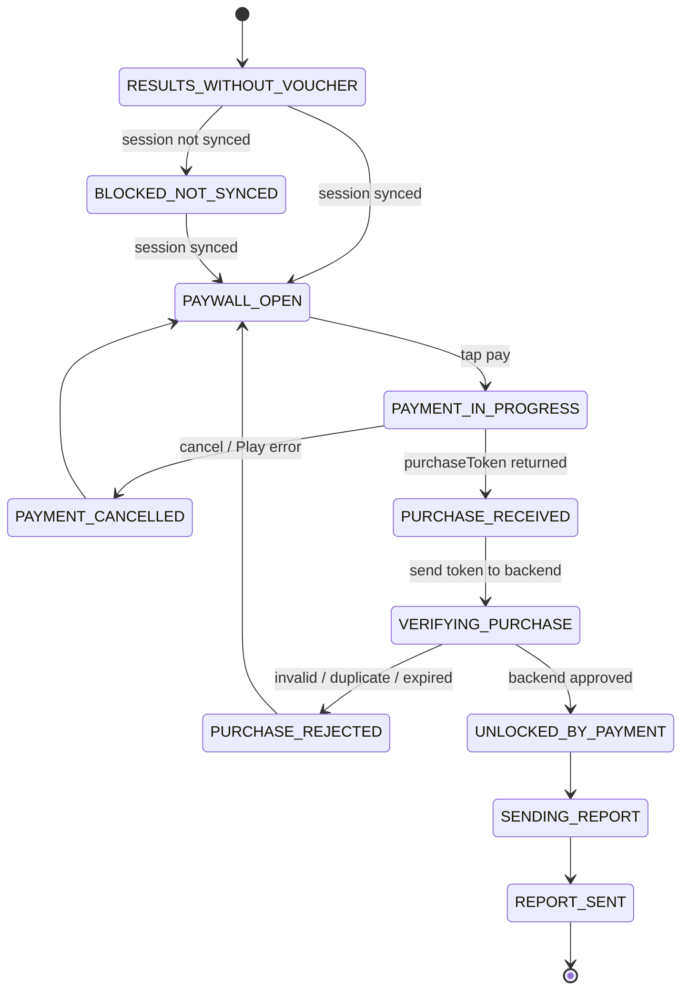

# Monetización del informe sin voucher

Este documento define el plan de implementación para cobrar el informe cuando el usuario termina el test y no tiene voucher. El backend debe ser la **fuente de verdad** del pago; el cliente Android solo inicia la compra y refleja el estado.

---

## Objetivo

- Vender el informe como un producto de Google Play.
- Verificar la compra en backend antes de desbloquear el reporte.
- Mantener auditabilidad, idempotencia y soporte para cancelaciones/reembolsos.

---

## Decisión de arquitectura

- **Tipo de producto:** one-time product.
- **Naturaleza del producto:** consumable, porque el usuario puede pagar informes distintos en sesiones distintas.
- **Fuente de verdad:** backend.
- **MVP operativo:** requerir que la sesión esté sincronizada antes de permitir el pago.
- **Regla de seguridad:** no confiar en el estado de pago del cliente.

---

## Flujo completo

---

## Estados del flujo

### 1) Estados de UI / negocio

| Estado | Qué significa |
|---|---|
| `RESULTS_WITHOUT_VOUCHER` | El usuario terminó el test y no tiene voucher. |
| `PAYWALL_OPEN` | La pantalla de pago está visible y lista para comprar. |
| `BLOCKED_NOT_SYNCED` | La compra está bloqueada porque la sesión todavía no se sincronizó. |
| `PAYMENT_IN_PROGRESS` | El flujo de Google Play Billing está abierto. |
| `PURCHASE_RECEIVED` | Play devolvió un token y la compra quedó registrada en la app. |
| `VERIFYING_PURCHASE` | La app está esperando que el backend valide la compra. |
| `UNLOCKED_BY_PAYMENT` | El backend aprobó el pago y el informe puede desbloquearse. |
| `SENDING_REPORT` | El backend está generando y/o enviando el informe. |
| `REPORT_SENT` | El informe ya fue entregado. |
| `PAYMENT_CANCELLED` | El usuario canceló la compra o Play cerró el flujo. |
| `PAYMENT_FAILED` | Hubo un error recuperable de red, billing o backend. |
| `PURCHASE_REJECTED` | El backend rechazó el token o detectó una compra inválida. |

### 2) Estados de compra Google Play

| Estado Play | Uso en el flujo |
|---|---|
| `PENDING` | La compra todavía no se confirmó o depende de una acción pendiente. |
| `PURCHASED` | La compra fue realizada y se puede verificar en backend. |
| `CANCELED` / `VOIDED` | La compra se canceló, se revocó o quedó inválida. |

### 3) Estado final de dominio

El dominio hoy ya conoce el desbloqueo por pago mediante `UNLOCKED_BY_PAYMENT`.  
Ese debe seguir siendo el estado final que habilita el envío del informe.

---

## PRs sugeridas para backend

### PR 1 — `feat(payments): define Google Play monetization contract`

Responsabilidad:
- Crear el módulo `payments`.
- Definir el contrato de verificación.
- Extender la entidad de sesión con el token/entitlement necesario.
- Preparar la migración correspondiente.

Archivos esperados:
- `apps/api/src/app.module.ts`
- `apps/api/src/payments/*`
- `apps/api/src/sessions/entities/session.entity.ts`
- `apps/api/src/migrations/*`

### PR 2 — `feat(payments): verify and persist Google Play purchases`

Responsabilidad:
- Implementar verificación server-side con Google Play Developer API.
- Persistir `PAID`, `paidAt`, `reportUnlockedAt` y la referencia de compra.
- Asegurar idempotencia para retries.
- Consumir o reconocer la compra según el modelo de producto.

Archivos esperados:
- `apps/api/src/payments/*`
- `.env.example`
- configuración de Google Play Developer API / service account

## Checklist técnico del PR 2 — Backend

Este PR debería dejar funcionando la verificación real de Google Play y la persistencia del entitlement.

- [ ] Crear el cliente o wrapper de Google Play Developer API.
- [ ] Leer credenciales desde variables de entorno.
- [ ] Verificar `purchaseToken` contra el `productId` correcto.
- [ ] Detectar respuestas `valid`, `duplicate`, `invalid` y `transient_error`.
- [ ] Persistir el resultado y marcar la sesión como `PAID`.
- [ ] Guardar `paidAt`, `reportUnlockedAt` y `paymentReference`.
- [ ] Aplicar idempotencia por `purchaseToken`.
- [ ] Consumir o reconocer la compra según el modelo final del producto.
- [ ] Agregar tests del servicio para happy path, duplicado y fallos.

---

## Orden de implementación sugerido del PR 2

### Paso 1 — Configurar el acceso a Google Play

Empezar por:

- `.env.example`
- credenciales / service account
- módulo o provider de Google Play

Objetivo: dejar listo el acceso autenticado antes de tocar la lógica de negocio.

### Paso 2 — Implementar la verificación

Empezar por:

- `apps/api/src/payments/*`

Objetivo: validar `purchaseToken` y normalizar la respuesta del provider.

### Paso 3 — Persistir el entitlement

Empezar por:

- `apps/api/src/sessions/entities/session.entity.ts`
- migración nueva o pendiente

Objetivo: guardar `PAID`, `paidAt`, `reportUnlockedAt` y la referencia de compra.

### Paso 4 — Cerrar el ciclo de compra

Empezar por:

- lógica de consumo / reconocimiento
- tests de integración o servicio

Objetivo: dejar el flujo idempotente y listo para retries.

---

### PR 3 — `feat(sessions): gate report delivery by entitlement`

Responsabilidad:
- Hacer que el envío del informe solo se permita si la sesión está `PAID` o `VOUCHER_REDEEMED`.
- Ajustar analytics y formatter del dashboard si hoy asumen solo voucher/no voucher.
- Agregar tests del happy path y del rechazo.

Archivos esperados:
- `apps/api/src/sessions/sessions.service.ts`
- `apps/api/src/sessions/sessions.controller.ts`
- `apps/api/src/sessions/services/admin-dashboard-formatter.service.ts`
- `apps/api/src/institutions/services/institution-analytics.service.ts`

## Checklist técnico del PR 3 — Backend

Este PR debería impedir cualquier envío de informe que no tenga entitlement válido.

- [ ] Bloquear `send-report` cuando la sesión no esté `PAID` ni `VOUCHER_REDEEMED`.
- [ ] Centralizar la validación en `SessionsService`, no solo en el controller.
- [ ] Mantener intacto el camino de voucher.
- [ ] Ajustar el formatter del dashboard para distinguir pago vs voucher.
- [ ] Ajustar analytics institucionales que agrupan sesiones por canal.
- [ ] Agregar tests del happy path, rechazo y compatibilidad con voucher.

---

## Orden de implementación sugerido del PR 3

### Paso 1 — Proteger el envío del informe

Empezar por:

- `apps/api/src/sessions/sessions.service.ts`
- `apps/api/src/sessions/sessions.controller.ts`

Objetivo: hacer que ningún request no habilitado llegue al proceso de entrega.

### Paso 2 — Ajustar lectura y reporting

Empezar por:

- `apps/api/src/sessions/services/admin-dashboard-formatter.service.ts`
- `apps/api/src/institutions/services/institution-analytics.service.ts`

Objetivo: reflejar correctamente el nuevo canal `PAID`.

### Paso 3 — Cubrir con tests

Empezar por:

- tests de `sessions.service`
- tests del formatter / analytics

Objetivo: asegurar que el flujo voucher siga funcionando y que el pago no se rompa.

---

## Checklist técnico del PR 1 — Backend

Este PR debería dejar listo el **contrato** y la estructura base, sin mezclar todavía toda la lógica de verificación completa.

- [ ] Confirmar el `productId` final del one-time product.
- [ ] Crear `PaymentsModule` en `apps/api/src/payments/`.
- [ ] Definir el DTO de verificación con `sessionId`, `productId` y `purchaseToken`.
- [ ] Definir la respuesta del endpoint: `valid`, `invalid`, `duplicate`, `transient_error`.
- [ ] Elegir si el entitlement vive en `session` o en una tabla de pagos separada.
- [ ] Agregar la migración necesaria para persistir el estado mínimo.
- [ ] Definir estrategia de idempotencia basada en `purchaseToken`.
- [ ] Dejar preparado el cliente de Google Play Developer API para la siguiente PR.
- [ ] Registrar variables de entorno faltantes en `.env.example`.
- [ ] Agregar tests de contrato para el request y la respuesta.

---

## Orden de implementación sugerido

### Paso 1 — Backend: contrato mínimo

Empezar por:

- `apps/api/src/app.module.ts`
- `apps/api/src/payments/payments.module.ts`
- `apps/api/src/payments/dto/*`
- `apps/api/src/sessions/entities/session.entity.ts`

Objetivo: dejar definido el contrato y la persistencia mínima.

### Paso 2 — Android: estructura del billing flow

Empezar por:

- `app/src/main/AndroidManifest.xml`
- `app/src/main/java/com/akit/app/ui/viewmodel/ReportViewModel.kt`
- `app/src/main/java/com/akit/app/di/NetworkModule.kt`
- `app/src/main/java/com/akit/app/ui/screens/reportunlock/*`

Objetivo: que la UI ya dispare el flujo y sepa mostrar estados.

### Paso 3 — Backend: verificación real

Empezar por:

- `apps/api/src/payments/*`
- migración pendiente
- `.env.example`

Objetivo: validar `purchaseToken` con Google Play y marcar la sesión como pagada.

### Paso 4 — Backend + Android: gating final y recovery

Empezar por:

- `apps/api/src/sessions/sessions.service.ts`
- `apps/api/src/sessions/sessions.controller.ts`
- `app/src/test/java/com/akit/app/ui/viewmodel/ReportViewModelTest.kt`

Objetivo: asegurar que solo se entregue el reporte cuando el entitlement esté aprobado.

---

## Contrato mínimo esperado desde Android

El backend debería exponer un endpoint de verificación con, al menos:

- `sessionId`
- `productId`
- `purchaseToken`

Respuesta esperada:

- compra válida
- compra inválida
- compra ya procesada
- error transitorio / reintentar

---

## Play Console: lo que hay que configurar

- Crear el **one-time product** del informe.
- Configurar precio, regiones y tax/compliance.
- Crear y habilitar una **service account** para el Google Play Developer API.
- Dar permisos para leer datos financieros y órdenes.
- Cargar testers de licencia.
- Probar en **internal test track**.

---

## Flujo recomendado

1. El usuario termina el test.
2. Si no tiene voucher, ve la opción de pago.
3. Android inicia la compra con Google Play Billing.
4. La app recibe `purchaseToken`.
5. La app llama al backend.
6. El backend verifica la compra con Google Play.
7. El backend marca la sesión como pagada.
8. La app desbloquea el informe y dispara el envío.

---

## Riesgos / gotchas

- `SyncSessionWorker` no resuelve este caso: hoy solo procesa sesiones `PENDING`.
- El backend debe ser idempotente porque Play puede reintentar o la app puede repetir la verificación.
- Si no definimos bien el `productId` desde el inicio, después no lo vamos a poder cambiar sin dolor operativo.
- RTDN y Voided Purchases son muy recomendables para una segunda etapa.

---

## Estrategia de validación de la pasarela

La forma correcta de validar Google Play Billing es por capas:

1. **Mocks locales**  
   Sirven para probar ViewModel, UI y manejo de errores sin depender de Play.

2. **Internal test + license testers**  
   Es la mejor forma de validar el flujo real de Billing sin cobrar dinero.
   - La app debe estar publicada en un track de test.
   - El usuario debe ser tester de licencia para usar métodos de prueba.
   - Los productos one-time deben estar **Published/Active** para aparecer en Billing.

3. **Pruebas de casos reales del flujo**
   - compra aprobada
   - compra rechazada
   - compra pendiente
   - compra no acknowledgeada
   - compra duplicada / reintento
   - restore después de reiniciar la app

4. **Smoke test con pago real**
   Si necesitás validar cargo real, usá una cuenta **no license tester** con un método de pago real en un track de test o en producción.  
   Ojo: en test tracks, los usuarios pueden incurrir en cargos reales si no son license testers, y los releases de internal test están sujetos a límites de gasto.

### Regla práctica

- **Mocks = validan tu app**
- **License testers = validan la integración**
- **Pago real = valida la pasarela de verdad**

---

## Matriz de pruebas

> Nota: mientras la compra esté en `PENDING`, idealmente **no se llama al endpoint de verificación**. La verificación real empieza cuando Play la pasa a `PURCHASED`.

| Caso | Entorno | Cuenta | Método / input | Backend esperado | App esperado |
|---|---|---|---|---|---|
| Mock local de UI | Unit/UI tests | N/A | Fake `BillingClient` + fake backend | No llamadas reales | Estados correctos: loading, error, success, cancel |
| Compra aprobada | Internal test track | License tester | Test instrument que aprueba | `valid` → marca `PAID` | Desbloquea el informe y envía el reporte |
| Compra rechazada | Internal test track | License tester | Test instrument que rechaza | No persiste entitlement | Vuelve al paywall sin desbloquear |
| Compra pendiente → aprobada | Internal test track | License tester | Slow test card que aprueba luego | No verifica mientras está `PENDING`; luego `valid` cuando pasa a `PURCHASED` | No desbloquea hasta que llegue el estado final |
| Compra pendiente → rechazada | Internal test track | License tester | Slow test card que declina luego | No verifica mientras está `PENDING`; luego `invalid`/cancel | No desbloquea y mantiene el flujo recuperable |
| Duplicado / retry | Internal test track o restore | License tester | Reenviar el mismo `purchaseToken` | `duplicate` / already processed | Trata la respuesta como idempotente, sin doble envío |
| Restore después de reinicio | Internal test track | License tester | Cerrar app y reabrir con compra previa | Revalida compra ya hecha | Recupera el entitlement con `queryPurchasesAsync` |
| Sin acknowledge | Internal test track | License tester | No hacer acknowledge en el build de prueba | La compra termina revertida/refunded | No se considera pagada; debe reintentarse |
| Smoke test con pago real | Track de test o producción | No license tester | Método de pago real | `valid` y persistencia real | Confirma que la pasarela cobra y desbloquea |

---

## Próximo paso recomendado

Empezar por el contrato del backend y el PR 1 de Android en paralelo.  
Eso nos deja el terreno listo para implementar sin inventar el flujo sobre la marcha.
